# Design System — Complete Learning Handbook

> A comprehensive, implementation-oriented guide based on the open-source [roadmap.sh Design System Roadmap](https://roadmap.sh/design-system), expanded for modern product teams and frontend engineers.
>
> Source roadmap repository: [kamranahmedse/developer-roadmap](https://github.com/kamranahmedse/developer-roadmap)
>
> This is **not a verbatim copy** of roadmap.sh. It reorganizes, explains, and extends the roadmap into a single learning document that you can read from top to bottom without opening every node.

---

## Table of Contents

1. [The Big Picture](#1-the-big-picture)
2. [Design System Basics](#2-design-system-basics)
3. [Terminology](#3-terminology)
4. [Atomic Design](#4-atomic-design)
5. [Stakeholders and Team Models](#5-stakeholders-and-team-models)
6. [When You Need a Design System](#6-when-you-need-a-design-system)
7. [Building From Scratch vs Existing Product](#7-building-from-scratch-vs-existing-product)
8. [Existing Design Analysis](#8-existing-design-analysis)
9. [Creating the Design Language](#9-creating-the-design-language)
10. [Accessibility Foundations](#10-accessibility-foundations)
11. [Design Tokens](#11-design-tokens)
12. [Layout System](#12-layout-system)
13. [Color System](#13-color-system)
14. [Iconography](#14-iconography)
15. [Typography](#15-typography)
16. [Motion and Interaction](#16-motion-and-interaction)
17. [Core Components](#17-core-components)
18. [Component API Design](#18-component-api-design)
19. [Patterns, Templates, and Product-Specific Components](#19-patterns-templates-and-product-specific-components)
20. [Documentation](#20-documentation)
21. [Tooling](#21-tooling)
22. [Testing Strategy](#22-testing-strategy)
23. [Versioning and Releases](#23-versioning-and-releases)
24. [Contribution and Governance](#24-contribution-and-governance)
25. [Project Management](#25-project-management)
26. [Analytics and Health Metrics](#26-analytics-and-health-metrics)
27. [Reference Architecture for a Modern Web Design System](#27-reference-architecture-for-a-modern-web-design-system)
28. [End-to-End Workflow](#28-end-to-end-workflow)
29. [Practical Learning Path](#29-practical-learning-path)
30. [Design System Review Checklist](#30-design-system-review-checklist)
31. [Recommended References](#31-recommended-references)

---


# 1. The Big Picture

A design system is a **shared product-design infrastructure**.

It is not just a Figma file.

It is not just a React component library.

It is not just a collection of colors and fonts.

A mature design system connects:

- brand
- product design
- UX principles
- content rules
- design tokens
- reusable components
- accessibility
- engineering conventions
- documentation
- testing
- releases
- contribution workflows
- governance
- analytics

A useful mental model is:

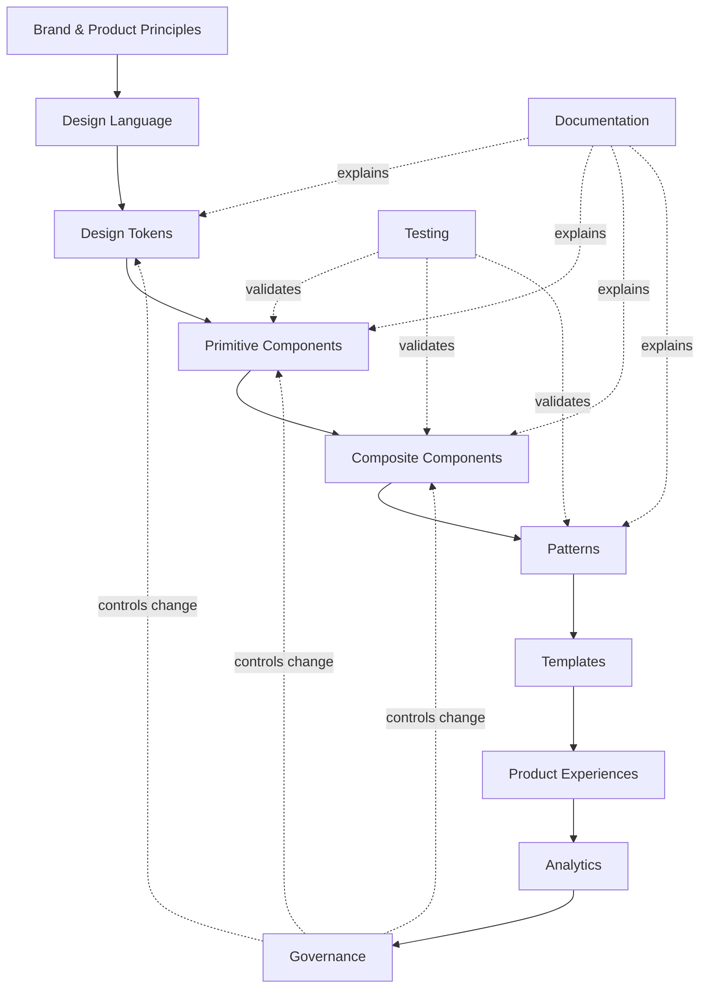


The design system sits **between product intent and product implementation**.

---


# 2. Design System Basics


## 2.1 What is a design system?

A design system is a set of standards, reusable assets, components, rules, and processes used to create consistent product experiences at scale.

A strong design system provides a shared answer to questions such as:

- Which color should represent danger?
- What spacing should exist between a label and an input?
- How should a modal trap keyboard focus?
- What is the standard empty state?
- Which button is primary?
- What is the correct radius for cards?
- How do we support dark mode?
- How do designers and engineers refer to the same component?
- When should a component be deprecated?
- How are breaking changes released?

The key idea is **shared decisions**.

Without a system, every product team repeatedly makes the same decisions.

With a system, many of those decisions are made once and reused.

---


## 2.2 Why design systems exist

Typical benefits:

### Consistency

The same interaction should behave similarly everywhere.

### Speed

Teams can compose interfaces instead of rebuilding everything.

### Reduced design debt

Repeated one-off decisions are replaced by reusable conventions.

### Reduced engineering debt

Shared components reduce duplicated implementations.

### Accessibility

Accessibility behavior can be solved once at the component level and reused.

### Brand consistency

Visual identity becomes encoded in reusable primitives and tokens.

### Cross-team communication

Instead of saying:

> "Use that small gray text under the field."

the team can say:

> "Use `Text` with `variant="caption"` and `color="muted"`."

Shared vocabulary is extremely valuable.

---


## 2.3 Design system vs component library

A **component library** is one implementation layer of a design system.

A design system additionally includes:

- rationale
- principles
- accessibility requirements
- usage guidance
- content guidance
- tokens
- design assets
- contribution rules
- versioning
- governance
- release strategy
- documentation

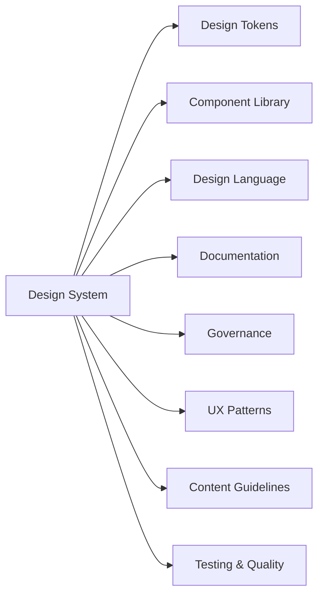


You can have a component library without a true design system.

A healthy design system almost always includes one or more component libraries.

---


# 3. Terminology


## Component

A reusable UI unit with a defined responsibility and interaction contract.

Examples:

- Button
- Input
- Checkbox
- Dialog
- Tabs
- Tooltip

---


## Component Library

A packaged set of reusable components.

Examples of tooling used to browse components:

- Storybook
- custom documentation portals
- design system websites

---


## Design Language

The visual and interaction vocabulary of a product.

It includes:

- color
- typography
- spacing
- shape
- motion
- iconography
- illustration
- content tone
- interaction principles

---


## Token

A named design decision represented as data.

Example:

```json
{
  "color": {
    "background": {
      "danger": {
        "$type": "color",
        "$value": "#D92D20"
      }
    }
  }
}
```

Conceptually:

```text
token name  -> semantic meaning -> resolved value
```

For example:

```text
color.background.danger -> destructive background -> #D92D20
```

---


## UI Kit

A design-tool representation of reusable system components.

For example:

- Figma component library
- Sketch library

A UI Kit usually represents the **design-side interface** of a design system.

---


## Pattern

A reusable solution for a recurring user experience problem.

Examples:

- authentication flow
- form validation
- search and filters
- empty state
- bulk selection
- destructive confirmation

Patterns usually combine multiple components.

---


## Governance

The decision-making framework for maintaining the system.

Governance answers:

- Who can add components?
- Who approves changes?
- How are proposals reviewed?
- What counts as a breaking change?
- Who owns accessibility?
- How are deprecated APIs removed?

---


## Pilot

A real product or feature used to validate the design system before wider adoption.

A pilot is extremely useful because isolated components often look perfect until used in an actual workflow.

---


# 4. Atomic Design

Brad Frost's Atomic Design is a mental model for understanding composition.

Classic levels:

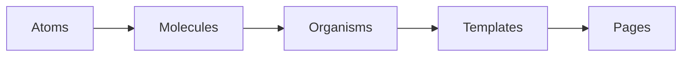


Examples:

### Atoms

- Button
- Icon
- Text
- Input


### Molecules

- SearchField
- FormField
- AvatarLabel


### Organisms

- Navbar
- CheckoutSummary
- DataTable


### Templates

- Dashboard layout
- Checkout layout
- Settings layout


### Pages

Real data rendered into templates.

---


## Important caveat

Atomic Design is useful for thinking, but component architecture should be based on **responsibility and reuse**, not forced taxonomy.

Do not waste time arguing whether something is technically a "molecule" or an "organism."

The useful question is:

> What responsibility does this abstraction own, and where should that responsibility live?

---


# 5. Stakeholders and Team Models

Design systems are multidisciplinary.

Typical stakeholders include:


| Role                          | Contribution                           |
| ----------------------------- | -------------------------------------- |
| Product Designer              | visual and interaction design          |
| Frontend Engineer             | reusable implementation                |
| Accessibility Specialist      | WCAG, keyboard, screen reader behavior |
| Content Designer              | tone, terminology, microcopy           |
| UX Researcher                 | user evidence                          |
| Product Manager               | prioritization and adoption            |
| Brand Designer                | brand expression                       |
| QA Engineer                   | validation                             |
| Developer Experience Engineer | tooling and documentation              |
| Leadership                    | funding and organizational alignment   |


---


## Team models


### Centralized

One dedicated design system team owns everything.

```text
Design System Team
      |
      +--> Product A
      +--> Product B
      +--> Product C
```

Good for consistency.

Risk: system team becomes a bottleneck.

---


### Federated

Product teams contribute to the system.

```text
Product A ---\
Product B ----> Shared Design System
Product C ---/
```

Good for scale.

Risk: inconsistent quality without strong governance.

---


### Hybrid

A core team owns architecture and quality while product teams contribute.

This is often the most practical model.

---


# 6. When You Need a Design System

A design system is useful when:

- multiple products share the same visual language
- multiple teams build similar interfaces
- UI inconsistencies are growing
- duplicated component implementations are common
- accessibility quality varies across teams
- brand changes are expensive
- product development is slowed by repeated UI decisions

You may **not** need a full system when:

- the product is still a tiny prototype
- the team is extremely small
- the UI is temporary
- product direction changes every week
- reuse is minimal

Premature abstraction is still abstraction debt.

---


## Design system maturity curve

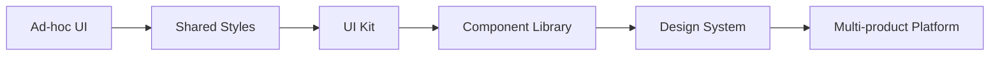


---


# 7. Building From Scratch vs Existing Product


## From scratch

If the product is new:

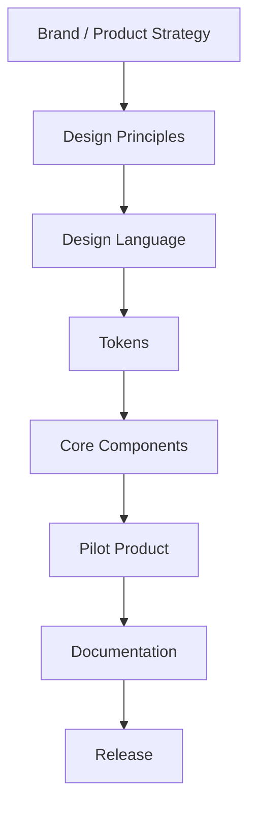


You can skip the large-scale visual audit because no legacy UI exists.

---


## From existing product

For an existing product:

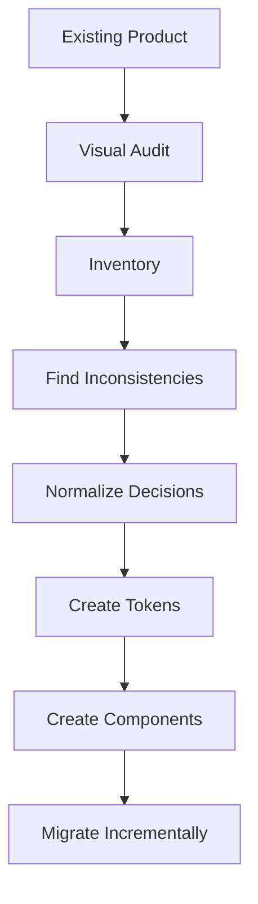


This path is often harder because you are replacing many undocumented decisions.

---


# 8. Existing Design Analysis

Before building a design system for an existing product, understand what already exists.

The original roadmap highlights:

- current design process
- visual audit
- design elements
- common components
- experimentation requirements
- locale requirements
- documentation

---


## 8.1 Understand the existing design process

Investigate:

- How do designs move from Figma to production?
- Who approves UX changes?
- How are components named?
- Where are shared assets stored?
- How does engineering decide whether to reuse or rebuild?
- What testing exists?
- How are releases coordinated?
- Which teams have unique requirements?

Also measure the organization's **design maturity**.

A technically perfect design system will fail if its workflow does not fit the company.

---


# 8.2 Visual audit

Take screenshots of representative product screens.

Group them by category:

```text
Buttons
Inputs
Navigation
Cards
Tables
Modals
Alerts
Typography
Colors
Spacing
Forms
Empty states
Loading states
```

Then identify variation.

Example:

```text
Button audit

Blue #0066FF  radius 4   height 36
Blue #005EEB  radius 6   height 40
Blue #126BFF  radius 8   height 40
Blue #0066FF  radius 8   height 44
```

The point is not immediately to decide which one is correct.

The first objective is to expose accidental inconsistency.

---


# 8.3 Identify design elements

Create an inventory of foundational values:

- colors
- font families
- font sizes
- font weights
- line heights
- spacing
- borders
- radius
- shadows
- icon sizes
- breakpoints
- z-index layers
- motion durations
- easing curves

Later, these become token candidates.

---


# 8.4 Identify components

Inventory repeated UI.

For each component, record:

```text
Component
Variants
Sizes
States
Behaviors
Responsive behavior
Accessibility behavior
Existing implementations
Usage frequency
```

Example:

```text
Button
├── variants
│   ├── primary
│   ├── secondary
│   ├── ghost
│   └── destructive
├── sizes
│   ├── sm
│   ├── md
│   └── lg
└── states
    ├── default
    ├── hover
    ├── active
    ├── focus-visible
    ├── disabled
    └── loading
```

---


# 8.5 Experiments and A/B testing

A rigid design system can accidentally make experimentation difficult.

Support controlled variation.

Useful strategies:

- component-level feature flags
- experimental variants
- extension slots
- temporary token overrides
- documented escape hatches

But experimentation should not become an excuse for permanent inconsistency.

---


# 8.6 Regional requirements

Consider:

- RTL
- translated text expansion
- locale-specific date formats
- locale-specific number formats
- CJK typography
- different address formats
- different input methods

Never assume English UI dimensions represent all locales.

---


# 8.7 Audit output

Your audit should result in a document containing:

- visual inventory
- component inventory
- known inconsistencies
- migration risks
- design debt
- accessibility debt
- duplicated implementations
- high-value consolidation opportunities

---


# 9. Creating the Design Language

The design language defines how the product expresses itself.

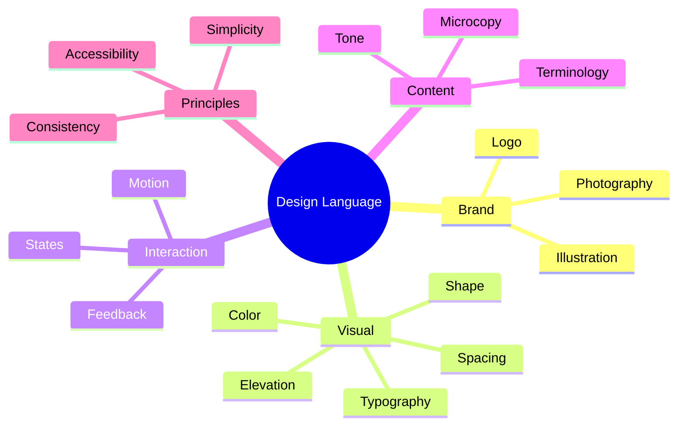


---


## 9.1 Brand

Brand is more than the logo.

It includes:

- identity
- personality
- values
- visual style
- tone

The design system translates the brand into repeatable product decisions.

---


## 9.2 Vision

Define why the system exists.

Example:

> Enable teams to ship accessible, consistent financial interfaces without repeatedly solving foundational UI problems.

A good vision guides prioritization.

---


## 9.3 Design principles

Design principles are decision filters.

Examples:

### Clear before clever

Prefer understandable UI over visually impressive but confusing UI.

### Accessible by default

A developer should need extra work to make a component inaccessible, not extra work to make it accessible.

### Progressive complexity

Simple use cases should be simple; advanced behavior should still be possible.

### Familiar interaction

Use platform conventions unless breaking them creates substantial value.

---


## 9.4 Terminology

Create consistent product vocabulary.

Bad:

```text
Remove account
Delete account
Close account
Deactivate account
```

if they all mean the same operation.

Choose one canonical term.

Terminology belongs in:

- product copy
- docs
- design names
- component APIs

---


## 9.5 Tone of voice

Tone should define how the product speaks.

Questions:

- Formal or conversational?
- Technical or plain language?
- Confident or cautious?
- How are errors phrased?
- How are destructive actions phrased?

---


## 9.6 Writing guidelines

Document:

- capitalization
- punctuation
- button labels
- error messages
- date formatting
- numeric formatting
- abbreviations
- empty states
- confirmation messages

---


## 9.7 Microcopy

Components often need standard content patterns.

Examples:

### Error

Prefer:

```text
Enter a valid email address.
```

instead of:

```text
Invalid input.
```


### Destructive confirmation

Explain consequence:

```text
Delete API key?

Applications using this key will immediately stop authenticating.
```

---


# 10. Accessibility Foundations

Accessibility must be architectural, not decorative.

The system should target at least a clearly defined accessibility baseline such as WCAG AA where applicable.

Key areas:

- semantic HTML
- keyboard navigation
- focus management
- screen reader labels
- color contrast
- reduced motion
- touch target size
- error identification
- form labeling
- live announcements

---


## Accessibility hierarchy

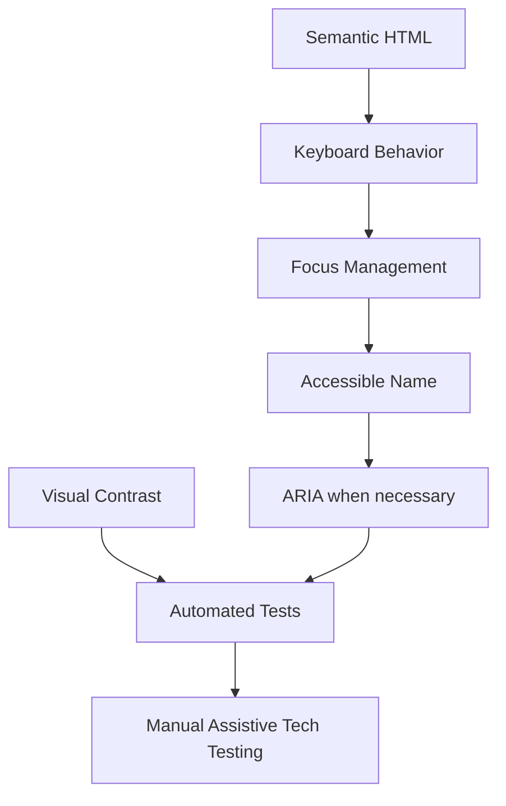


Important:

> ARIA does not replace semantic HTML.

A native `<button>` is almost always better than a clickable `<div>` with manually recreated keyboard semantics.

---


# 11. Design Tokens

Tokens are one of the most important architectural layers.

They convert design decisions into data.

---


## 11.1 Why tokens?

Without tokens:

```css
.card {
  color: #161616;
  background: #ffffff;
  border-radius: 8px;
}

.modal {
  color: #161616;
  background: #ffffff;
  border-radius: 8px;
}
```

With tokens:

```css
.card,
.modal {
  color: var(--color-text-primary);
  background: var(--color-surface-primary);
  border-radius: var(--radius-md);
}
```

The important difference is **semantic meaning**.

---


## 11.2 Token layers

A robust model:

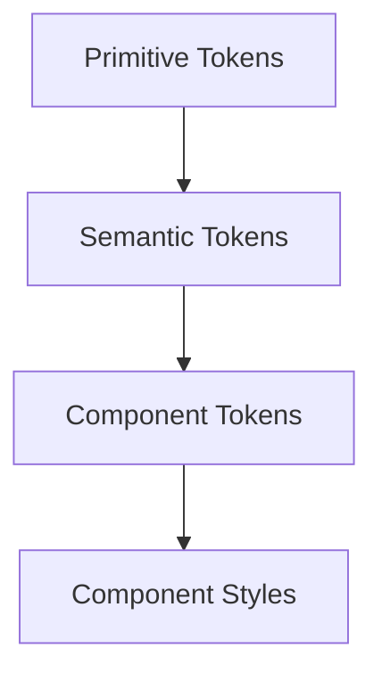


### Primitive tokens

Raw scales.

```text
blue.500
gray.100
space.4
radius.2
```


### Semantic tokens

Describe purpose.

```text
color.text.primary
color.text.danger
color.background.surface
color.border.muted
```


### Component tokens

Optional layer for component-specific decisions.

```text
button.primary.background
button.primary.text
button.primary.backgroundHover
```

---


## 11.3 Avoid value-oriented naming

Bad:

```text
color.blue
color.lightGray
spacing.16
```

for application-level usage.

Better:

```text
color.action.primary
color.border.default
spacing.component.gap
```

Semantic naming enables themes.

---


## 11.4 Aliasing

```text
color.blue.600
      ↓
color.action.primary
      ↓
button.primary.background
```

Change the primitive mapping and the component updates without changing component code.

---


## 11.5 DTCG token format

The Design Tokens Community Group published a stable token specification in 2025.

Example style:

```json
{
  "color": {
    "brand": {
      "primary": {
        "$type": "color",
        "$value": {
          "colorSpace": "srgb",
          "components": [0.1, 0.3, 0.8],
          "alpha": 1
        }
      }
    }
  }
}
```

References can map semantic tokens to primitives.

Conceptually:

```json
{
  "color": {
    "action": {
      "primary": {
        "$type": "color",
        "$value": "{color.brand.primary}"
      }
    }
  }
}
```

---


## 11.6 Token categories

Common categories:

```text
color
typography
spacing
size
radius
border
shadow
opacity
motion
breakpoint
z-index
```

---


## 11.7 Multi-theme architecture

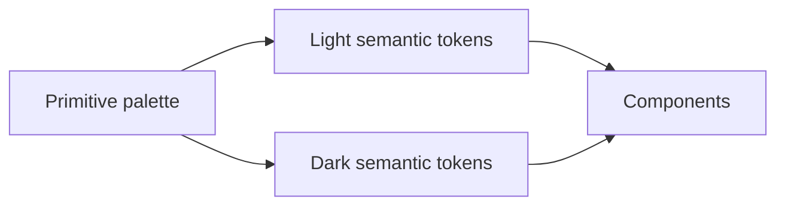


Components should prefer semantic tokens:

```css
background: var(--color-bg-surface);
color: var(--color-text-primary);
```

not:

```css
background: var(--white);
color: var(--gray-900);
```

---


# 12. Layout System

A coherent layout system makes interfaces predictable.

Main concepts:

- spacing
- units
- grid
- breakpoints
- container widths
- responsive rules

---


## 12.1 Spacing

Use a constrained scale.

Example:

```text
0
2
4
8
12
16
20
24
32
40
48
64
```

Not every numerical value needs to exist.

Constraints reduce random decisions.

---


## 12.2 Base unit

Many systems are built around a 4px rhythm.

Example:

```text
1 unit = 4px
2 = 8px
3 = 12px
4 = 16px
6 = 24px
8 = 32px
```

Do not treat this as a law.

Use a scale appropriate to your product.

---


## 12.3 Breakpoints

Breakpoints should respond to layout needs, not specific device brands.

Example:

```css
--breakpoint-sm: 640px;
--breakpoint-md: 768px;
--breakpoint-lg: 1024px;
--breakpoint-xl: 1280px;
```

---


## 12.4 Grid

Define:

- column count
- gutter
- outer margin
- maximum content width

Example:

```text
Mobile:  4 columns
Tablet:  8 columns
Desktop: 12 columns
```

---


# 13. Color System

Color is both brand expression and functional communication.

A useful architecture:

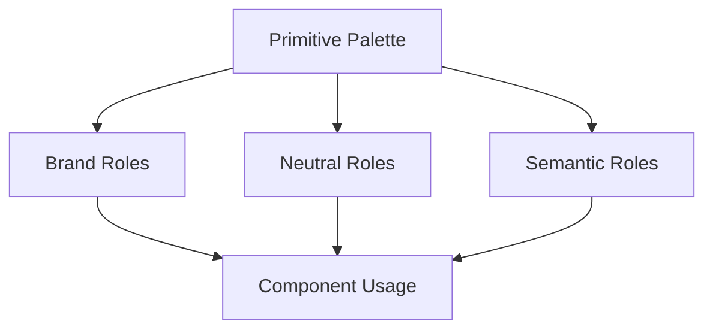


---


## 13.1 Functional colors

Typical semantic roles:

```text
success
warning
danger
info
disabled
focus
selected
```

Avoid communicating state by color alone.

Pair color with:

- icon
- text
- shape
- status label

---


## 13.2 Dark mode

Dark mode is not:

```text
white -> black
black -> white
```

It requires semantic remapping.

Example:

```text
light:
surface.primary -> gray.0
text.primary    -> gray.950

dark:
surface.primary -> gray.950
text.primary    -> gray.50
```

---


## 13.3 Contrast

Text/background combinations should be tested.

Document **approved pairings**.

Example:

```text
surface/default + text/default
surface/brand + text/on-brand
surface/danger + text/on-danger
```

This prevents developers from accidentally pairing incompatible tokens.

---


# 14. Iconography

Icons should behave like a coherent family.

Define:

- visual style
- grid
- stroke width
- filled vs outline
- size scale
- naming
- accessibility
- reserved system meanings

---


## 14.1 Naming

Name icons by shape/object where possible.

Prefer:

```text
trash
arrow-left
chevron-down
calendar
```

instead of:

```text
delete
back
open-menu
schedule
```

Behavior-specific aliases can be created later.

---


## 14.2 Size

Typical scale:

```text
12
16
20
24
32
```

Icons should align well with typography.

---


## 14.3 Accessibility

Decorative icon:

```tsx
<Icon name="check" aria-hidden="true" />
```

Icon-only button:

```tsx
<Button aria-label="Close">
  <XIcon />
</Button>
```

Do not assume screen readers understand an SVG's visual meaning.

---


# 15. Typography

Typography controls:

- hierarchy
- readability
- information density
- brand personality

Define:

- font family
- size
- weight
- line height
- letter spacing
- paragraph spacing
- max line length

---


## Example scale

```text
display-lg
display-md
heading-lg
heading-md
heading-sm
body-lg
body-md
body-sm
caption
```

Each token can represent a bundle:

```ts
const typography = {
  bodyMd: {
    fontSize: "16px",
    lineHeight: "24px",
    fontWeight: 400,
    letterSpacing: "0",
  },
};
```

---


## Responsive typography

Fluid typography may use `clamp()`:

```css
font-size: clamp(2rem, 4vw, 4rem);
```

But use it intentionally.

Not every UI label needs fluid scaling.

---


## Performance

Custom fonts affect:

- download size
- first render
- layout shifts

Consider:

- font subsetting
- preload
- `font-display`
- variable fonts
- system fallbacks

---


# 16. Motion and Interaction

A modern design system should define motion even if the original roadmap gives it less emphasis.

Tokenize:

```text
duration.fast
duration.normal
duration.slow

easing.standard
easing.enter
easing.exit
```

Example:

```css
--duration-fast: 120ms;
--duration-normal: 200ms;
--ease-standard: cubic-bezier(.2, 0, 0, 1);
```

---


## Motion principles

Use motion to communicate:

- state change
- spatial relationship
- feedback
- hierarchy

Avoid motion that exists only as decoration when it slows interaction.

---


## Reduced motion

Respect:

```css
@media (prefers-reduced-motion: reduce) {
  /* reduce or remove non-essential animation */
}
```

---


# 17. Core Components

The roadmap includes a practical set of foundational components.

This section explains what each must account for.

---


## 17.1 Avatar

Purpose: represent a user/entity.

Requirements:

- image
- fallback initials
- fallback icon
- multiple sizes
- accessible description where meaningful
- deterministic background if using initials

Possible API:

```tsx
<Avatar
  src={user.avatar}
  alt="Louis Mai"
  fallback="LM"
  size="md"
/>
```

---


# 17.2 Banner / Alert

Purpose: prominent contextual communication.

Variants:

```text
info
success
warning
danger
```

Consider:

- icon
- title
- body
- actions
- dismiss behavior
- live region behavior
- responsive layout

---


# 17.3 Badge

Purpose: compact status or metadata.

Examples:

```text
Active
Pending
Beta
3
```

Avoid making non-interactive badges look like buttons.

If removable, it may actually be closer to a chip/tag pattern.

---


# 17.4 Button

Purpose: trigger an action.

Variants:

```text
primary
secondary
ghost
destructive
link-like
```

States:

```text
default
hover
active
focus-visible
disabled
loading
```

Sizes:

```text
sm
md
lg
```

Core rules:

- use semantic `<button>`
- preserve accessible name
- loading state should not cause layout shift
- icon-only buttons require labels
- focus state must remain visible
- disabled styling must not rely only on opacity

Example API:

```tsx
<Button
  variant="primary"
  size="md"
  loading={isSaving}
>
  Save changes
</Button>
```

---


# 17.5 Card

Cards group related information.

Be careful not to make `Card` a meaningless generic rectangle.

Good Card API separates structural slots:

```tsx
<Card>
  <CardHeader />
  <CardContent />
  <CardFooter />
</Card>
```

If a whole card is clickable, avoid nesting conflicting interactive elements.

---


# 17.6 Carousel

Requirements:

- previous/next controls
- touch support
- keyboard access
- responsive behavior
- clear current position when relevant

Use native scrolling where possible.

Carousels are often overused.

---


# 17.7 Dropdown / Popover / Menu

These terms should not be mixed casually.

A robust system often distinguishes:

```text
Popover -> generic floating surface
Menu    -> list of actions
Listbox -> selection widget
Select  -> form selection control
Combobox -> text input + popup choices
```

Accessibility behavior differs significantly.

Important:

- positioning
- Escape behavior
- trigger relationship
- focus management
- keyboard navigation
- collision detection

Libraries such as Radix UI / React Aria / Floating UI can help solve these primitives.

---


# 17.8 Icon

Centralize:

- size
- color inheritance
- accessible behavior
- SVG normalization

Example:

```tsx
<Icon name="search" size="md" />
```

---


# 17.9 Checkbox

States:

- unchecked
- checked
- indeterminate
- disabled
- invalid
- focus-visible

Use a label.

Native checkbox semantics are extremely valuable.

---


# 17.10 Radio

Radio buttons represent **one selection from a set**.

Use a `RadioGroup`.

Keyboard behavior should follow platform expectations.

---


# 17.11 Text Input

Requirements:

- label
- optional description
- error message
- disabled
- readonly
- focus-visible
- prefix/suffix
- icons where appropriate
- autocomplete
- correct input type

Component composition:

```tsx
<Field>
  <FieldLabel>Email</FieldLabel>
  <Input type="email" />
  <FieldDescription />
  <FieldError />
</Field>
```

This is often more scalable than putting every concern directly on `Input`.

---


# 17.12 Switch

A Switch represents an immediate boolean setting.

Example:

```text
Enable notifications  [on/off]
```

Checkboxes are often better for form values that are submitted later.

---


# 17.13 Select

Prefer native `<select>` unless custom behavior is truly needed.

Custom select components are accessibility-heavy.

If building a custom one, define:

- keyboard navigation
- active option
- selected option
- focus behavior
- popup positioning
- screen-reader semantics
- long option lists
- mobile behavior

---


# 17.14 Textarea

Requirements largely mirror text input plus:

- minimum height
- resize behavior
- character count if needed

---


# 17.15 List

List abstractions may manage:

- vertical spacing
- horizontal spacing
- dividers
- actionable rows

Do not replace semantic `<ul>` / `<ol>` semantics when actual lists are present.

---


# 17.16 Loading Indicator

Types:

### Indeterminate

You do not know progress.

```text
spinner
skeleton
progress loop
```


### Determinate

You know progress.

```text
72%
```

Support reduced motion.

---


# 17.17 Modal / Dialog

One of the most accessibility-sensitive components.

Requirements:

- proper dialog semantics
- focus moves into dialog
- focus trapped appropriately
- Escape closes when allowed
- focus returns to trigger
- background interaction blocked
- accessible title
- optional description
- scroll handling

Example structure:

```tsx
<Dialog>
  <DialogTrigger />
  <DialogContent>
    <DialogTitle />
    <DialogDescription />
    ...
  </DialogContent>
</Dialog>
```

---


# 17.18 Tabs

Tabs should implement:

- `tablist`
- `tab`
- `tabpanel`
- active state
- keyboard navigation
- focus behavior

Do not use tabs for unrelated navigation just because the design looks tab-like.

---


# 17.19 Toast

Used for brief asynchronous feedback.

Requirements:

- queue behavior
- auto dismissal
- optional action
- screen reader announcement
- non-blocking behavior

Do not use a toast for errors that require immediate correction in a form.

---


# 17.20 Tooltip

Tooltips provide supplementary information.

Requirements:

- available on keyboard focus
- positioning
- delay
- Escape support where appropriate
- never contain critical information unavailable elsewhere

Do not make essential actions available only through hover.

---


# 18. Component API Design

A design system component is an API.

Treat it like one.

---


## 18.1 Prefer semantic props

Bad:

```tsx
<Button blue rounded shadow>
```

Better:

```tsx
<Button variant="primary" size="md">
```

The second describes intent rather than visual implementation.

---


## 18.2 Avoid boolean explosion

Bad:

```tsx
<Button
  primary
  secondary
  destructive
  compact
  large
  rounded
  square
/>
```

Impossible combinations become easy.

Prefer enums:

```tsx
<Button
  variant="destructive"
  size="lg"
/>
```

---


## 18.3 Composition over mega-components

Bad:

```tsx
<Card
  title=""
  subtitle=""
  image=""
  footer=""
  button=""
  badge=""
  menu=""
/>
```

Better:

```tsx
<Card>
  <CardHeader>
    ...
  </CardHeader>

  <CardContent>
    ...
  </CardContent>
</Card>
```

Composition scales better.

---


## 18.4 Controlled vs uncontrolled APIs

Example:

```tsx
<Dialog
  open={open}
  onOpenChange={setOpen}
/>
```

or:

```tsx
<Dialog defaultOpen />
```

Support both only when complexity is justified.

---


## 18.5 Escape hatches

Sometimes consumers need:

- `className`
- `style`
- `asChild`
- slot props
- render props

Escape hatches are useful.

But if every consumer must override the component, the design system abstraction is probably wrong.

---


# 19. Patterns, Templates, and Product-Specific Components

Do not put every repeated UI into the "core" package.

Use layers.

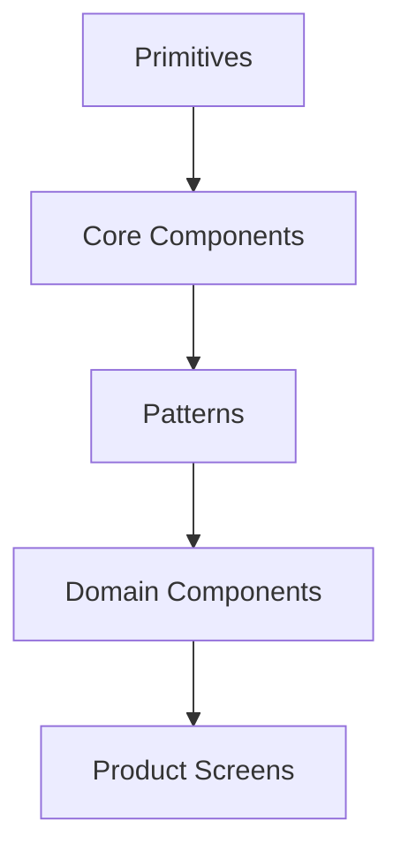


Example:

```text
Primitive:
  Popover

Core:
  Select

Pattern:
  SearchFilterBar

Domain:
  TransactionFilter

Product:
  TransactionsPage
```

This prevents the design system from becoming a giant product-specific dependency.

---


# 20. Documentation

Documentation drives adoption.

A technically excellent component that nobody understands will be reimplemented.

Every component should document:

```text
Purpose
When to use
When not to use
Anatomy
Variants
Sizes
States
Behavior
Accessibility
Content guidance
Examples
API
Known constraints
Migration notes
```

---


## Documentation information architecture

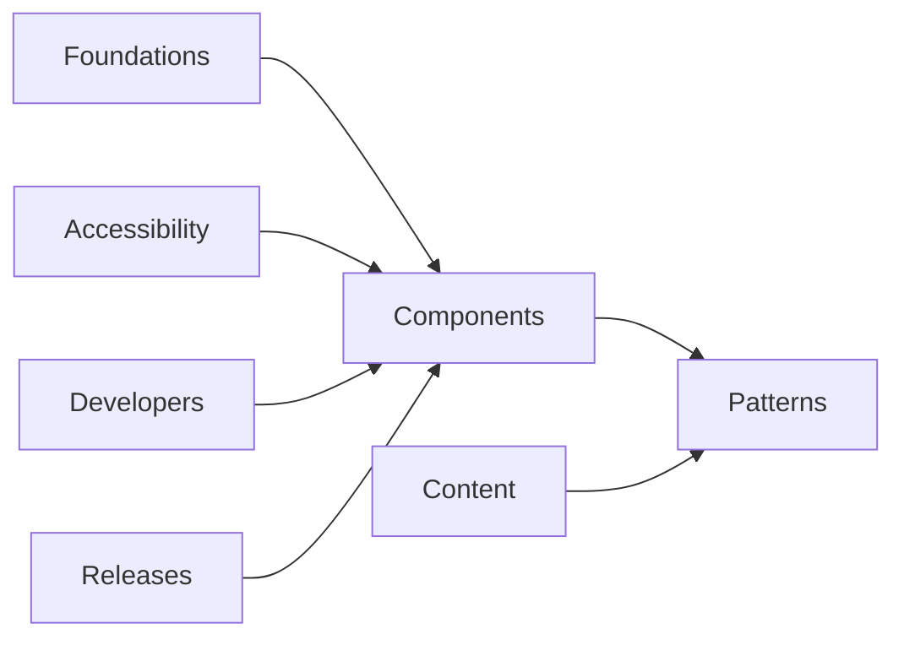


---


## Storybook

Storybook is especially useful for:

- isolated component rendering
- variants
- states
- visual regression
- interactive tests
- accessibility checks
- documentation

Example story matrix:

```text
Button
├── Default
├── Variants
├── Sizes
├── Icons
├── Loading
├── Disabled
├── Long text
├── Dark background
└── RTL
```

---


# 21. Tooling

Tooling makes the system easier to consume and harder to misuse.

The roadmap separates development tooling and design tooling.

---


## 21.1 Development tooling

Important areas:

- component catalog
- documentation
- code style
- unit tests
- accessibility tests
- versioning
- release automation
- commit conventions
- PR templates
- contribution guidelines

---


## 21.2 Design tooling

Typical design-side stack:

- Figma
- shared component libraries
- variables/tokens
- plugins
- branching/version history
- contribution workflow

Design and code should share the same conceptual model.

---


## 21.3 Code quality automation

Typical checks:

```text
lint
format
typecheck
unit tests
accessibility tests
build
visual regression
bundle size
```

Example pipeline:

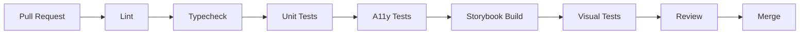


---


# 22. Testing Strategy

Design systems need unusually strong testing because one regression can affect many applications.

---


## Testing pyramid

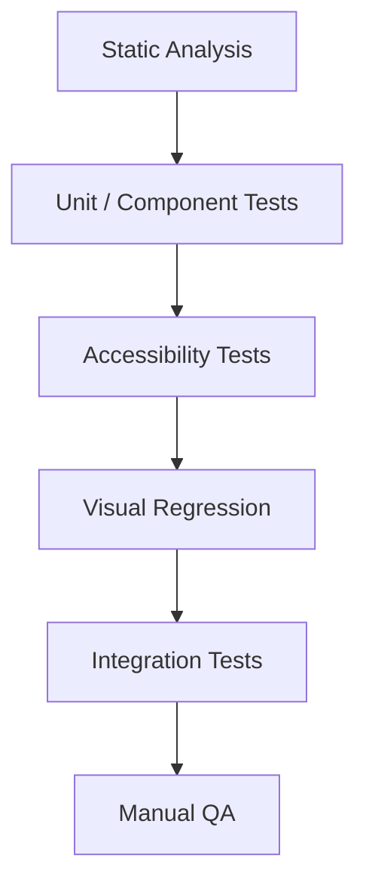


---


## 22.1 Static analysis

Use:

- TypeScript
- lint rules
- design-token linting
- dependency checks

---


## 22.2 Unit and component tests

Test behavior, not implementation details.

Example:

```text
Button:
- calls onClick
- disabled button cannot trigger
- loading state exposed correctly
- keyboard activation works
```

---


## 22.3 Accessibility tests

Automate with tools such as axe where possible.

But automated accessibility testing does not catch everything.

Manual testing still matters for:

- screen readers
- focus order
- interaction comprehension
- keyboard-only workflows

---


## 22.4 Visual regression

Very valuable for:

- layout changes
- token changes
- typography changes
- unexpected CSS regressions

Storybook-based screenshot testing is common.

---


## 22.5 Contract testing

If multiple frameworks consume shared tokens, test generated outputs.

Example:

```text
tokens.json
   ↓
CSS variables
   ↓
TypeScript
   ↓
Android
   ↓
iOS
```

A change should resolve consistently across all platforms.

---


# 23. Versioning and Releases

Use semantic versioning where applicable.

```text
MAJOR.MINOR.PATCH
```


### Patch

Bug fix without intended API break.

```text
2.4.1 -> 2.4.2
```


### Minor

Backward-compatible feature.

```text
2.4.2 -> 2.5.0
```


### Major

Breaking change.

```text
2.5.0 -> 3.0.0
```

---


## Release flow

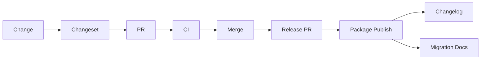


Tools such as Changesets can automate package versioning in monorepos.

---


## Deprecation strategy

Never remove widely used APIs immediately.

Suggested lifecycle:

```text
Supported
   ↓
Deprecated
   ↓
Migration warning
   ↓
Replacement available
   ↓
Removed in major release
```

---


# 24. Contribution and Governance

A design system must be easy to contribute to without becoming chaotic.

---


## Contribution proposal

A proposal should answer:

```text
Problem
Evidence
Existing workaround
Why existing components cannot solve it
Proposed API
Design
Accessibility behavior
Responsive behavior
Migration impact
Alternatives considered
```

---


## Governance workflow

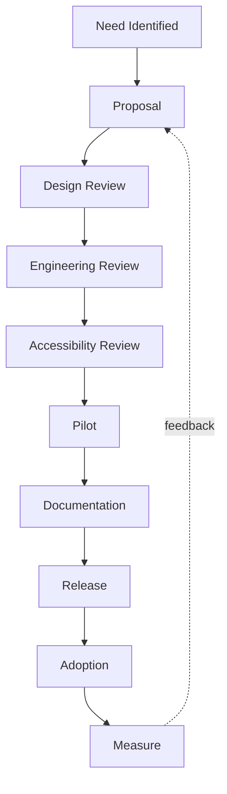


---


## Component admission criteria

Before adding a new core component, ask:

- Is the use case repeated?
- Is it product-agnostic?
- Will at least multiple consumers use it?
- Can an existing component be extended?
- Is the interaction pattern understood?
- Can accessibility be solved reliably?
- Can the API remain stable?

---


# 25. Project Management

The roadmap correctly treats a design system as a product.

You need:

- task management
- tickets
- milestones
- roadmap
- communication channels
- community meetings
- office/open hours
- FAQs

---


## Design system roadmap

Example:

```text
Q1
- token architecture
- Button
- Input
- Dialog
- Storybook

Q2
- forms
- data display
- dark mode
- migration tooling

Q3
- advanced patterns
- Figma-code sync
- analytics
```

Do not promise every component.

Prioritize by product impact.

---


## Community

Adoption improves when consumers can influence the system.

Useful channels:

- Slack/Teams channel
- RFC discussions
- GitHub Discussions
- office hours
- monthly system updates

---


# 26. Analytics and Health Metrics

A design system should measure whether it is actually useful.

The roadmap highlights:

- component analytics
- error logging
- tooling analytics
- service and health metrics

---


## 26.1 Component adoption

Measure:

```text
% screens using system components
% products using latest major version
most-used components
components with zero adoption
duplicate implementations
```

---


## 26.2 Migration health

Measure:

```text
deprecated API usage
old package versions
legacy CSS usage
hardcoded color usage
hardcoded spacing usage
```

---


## 26.3 Quality metrics

Examples:

```text
accessibility violations
visual regression failures
open component bugs
median issue resolution time
bundle size
build failures
```

---


## 26.4 Consumer satisfaction

Quantitative data is not enough.

Ask developers/designers:

- Is documentation sufficient?
- Which components are difficult to use?
- What are teams rebuilding locally?
- What prevents adoption?

---


# 27. Reference Architecture for a Modern Web Design System

A practical monorepo might look like:

```text
design-system/
├── apps/
│   ├── docs/
│   └── storybook/
│
├── packages/
│   ├── tokens/
│   ├── primitives/
│   ├── react/
│   ├── icons/
│   ├── eslint-config/
│   └── typescript-config/
│
├── .changeset/
├── package.json
├── pnpm-workspace.yaml
└── turbo.json
```

---


## Package relationships

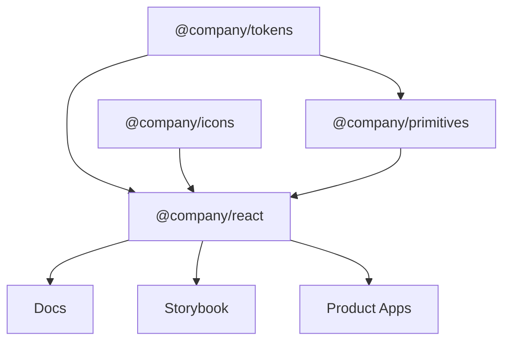


---


## Token package

Outputs might include:

```text
dist/tokens.css
dist/tokens.json
dist/tokens.ts
```

---


## React package

Example structure:

```text
src/
├── button/
│   ├── button.tsx
│   ├── button.test.tsx
│   ├── button.stories.tsx
│   └── index.ts
│
├── dialog/
├── input/
└── index.ts
```

---


## CSS strategy

Possible options:

- plain CSS
- CSS Modules
- Tailwind
- vanilla-extract
- Panda CSS
- CSS-in-JS

There is no universally correct answer.

Important requirements:

- token usage
- predictable styling
- theming
- SSR compatibility if needed
- low runtime cost
- consumer ergonomics

---


# 28. End-to-End Workflow

A mature flow from design decision to production:

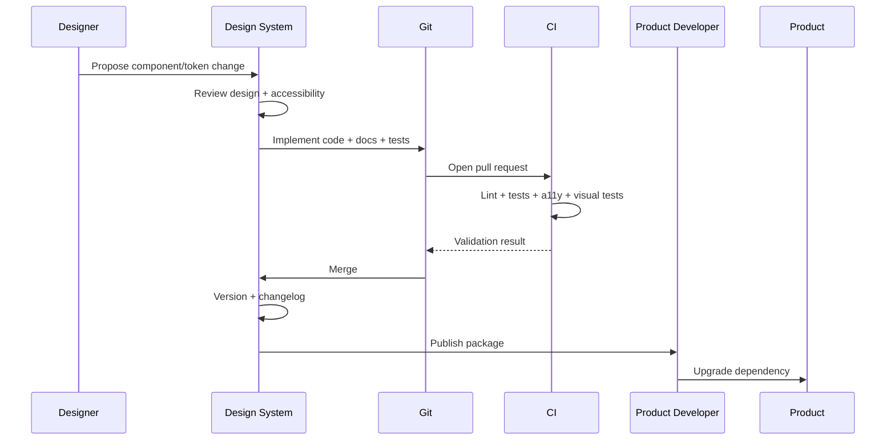


---


## Component lifecycle

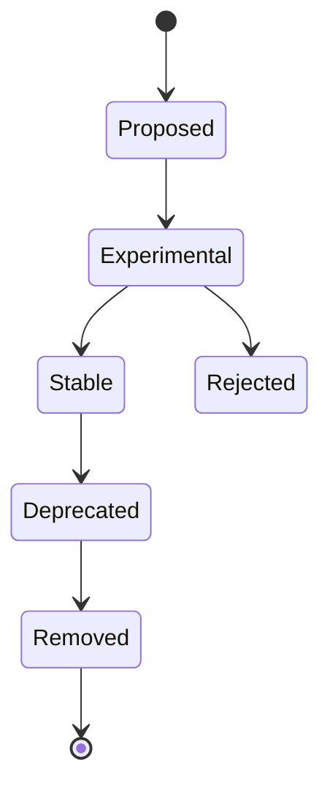


---


# 29. Practical Learning Path

Instead of memorizing the entire roadmap, build one small system.

---


## Phase 1 — Foundations

Learn:

- design system basics
- terminology
- atomic design
- accessibility
- token architecture

Build:

```text
color tokens
spacing tokens
radius tokens
typography tokens
```

---


## Phase 2 — Core UI

Build:

```text
Button
Input
Textarea
Checkbox
Radio
Switch
Badge
Avatar
```

For every component implement:

- variants
- state
- keyboard behavior
- accessibility
- Storybook
- tests

---


## Phase 3 — Overlay primitives

Build:

```text
Tooltip
Popover
Dropdown Menu
Dialog
Toast
```

This phase teaches:

- portals
- focus management
- positioning
- keyboard interaction
- screen reader behavior

---


## Phase 4 — Documentation and release engineering

Add:

```text
Storybook docs
changesets
CI
visual regression
package publishing
```

---


## Phase 5 — Product pilot

Build a real interface using only the system.

For example:

```text
Settings page
Dashboard
Checkout
Admin page
```

Record every place where you need to escape the system.

Those escape hatches expose missing abstractions.

---


# 30. Design System Review Checklist


## Foundations

- [ ] Design principles documented
- [ ] Terminology documented
- [ ] Brand rules documented
- [ ] Accessibility baseline defined
- [ ] Responsive strategy defined


## Tokens

- [ ] Primitive tokens exist
- [ ] Semantic tokens exist
- [ ] Components avoid raw visual values
- [ ] Light/dark themes map semantic roles
- [ ] Token naming is stable
- [ ] Token output can be consumed programmatically


## Typography

- [ ] Type scale
- [ ] Line height
- [ ] Weights
- [ ] Responsive rules
- [ ] Font-loading strategy


## Color

- [ ] Primitive palette
- [ ] Semantic roles
- [ ] Functional states
- [ ] Accessible combinations
- [ ] Dark mode


## Layout

- [ ] Spacing scale
- [ ] Breakpoints
- [ ] Grid
- [ ] Containers
- [ ] Responsive rules


## Components

- [ ] API documented
- [ ] states documented
- [ ] variants documented
- [ ] keyboard behavior documented
- [ ] screen-reader behavior documented
- [ ] responsive behavior documented
- [ ] unit/component tests
- [ ] accessibility tests
- [ ] visual regression tests
- [ ] Storybook examples


## Engineering

- [ ] TypeScript
- [ ] linting
- [ ] formatting
- [ ] CI
- [ ] semantic versioning
- [ ] changelog
- [ ] release automation
- [ ] contribution guide


## Governance

- [ ] ownership defined
- [ ] proposal process
- [ ] review process
- [ ] deprecation policy
- [ ] migration policy
- [ ] communication channel


## Analytics

- [ ] adoption metrics
- [ ] package-version metrics
- [ ] component usage
- [ ] error monitoring
- [ ] consumer feedback

---


# 31. Recommended References


## Original roadmap

- [roadmap.sh — Design System](https://roadmap.sh/design-system)
- [roadmap.sh GitHub — developer-roadmap](https://github.com/kamranahmedse/developer-roadmap)


## Design system fundamentals

- [Nielsen Norman Group — Design Systems 101](https://www.nngroup.com/articles/design-systems-101/)
- [Atomic Design — Brad Frost](https://atomicdesign.bradfrost.com/)


## Tokens

- [Design Tokens Community Group](https://www.designtokens.org/)
- [DTCG GitHub](https://github.com/design-tokens/community-group)


## Accessibility

- [W3C Web Accessibility Initiative](https://www.w3.org/WAI/)
- [WCAG](https://www.w3.org/WAI/standards-guidelines/wcag/)
- [ARIA Authoring Practices Guide](https://www.w3.org/WAI/ARIA/apg/)
- [WebAIM](https://webaim.org/)


## Component architecture

- [Storybook](https://storybook.js.org/)
- [React Aria](https://react-spectrum.adobe.com/react-aria/)
- [Radix Primitives](https://www.radix-ui.com/primitives)
- [Floating UI](https://floating-ui.com/)


## Public design systems worth studying

- [Material Design](https://m3.material.io/)
- [IBM Carbon](https://carbondesignsystem.com/)
- [Atlassian Design System](https://atlassian.design/)
- [Shopify Polaris](https://polaris.shopify.com/)
- [GOV.UK Design System](https://design-system.service.gov.uk/)
- [GitHub Primer](https://primer.style/)
- [Microsoft Fluent](https://fluent2.microsoft.design/)

---


# Final Mental Model

If you remember only one diagram, remember this:

```mermaid
flowchart TD
    A[Product / Brand Principles]
    B[Design Language]
    C[Design Tokens]
    D[Accessible Primitives]
    E[Reusable Components]
    F[Patterns]
    G[Product UI]
    H[Documentation]
    I[Testing]
    J[Governance]
    K[Analytics]

    A --> B --> C --> D --> E --> F --> G

    H -. teaches .-> C
    H -. teaches .-> E
    I -. protects .-> D
    I -. protects .-> E
    J -. evolves .-> C
    J -. evolves .-> E
    G --> K
    K -. informs .-> J
```


A design system is not a folder full of UI components.

It is a **feedback-driven system for turning product decisions into reusable, documented, accessible, testable, and governable building blocks**.

---


## Suggested build exercise

Build a small production-style system with:

```text
Tokens
├── color
├── spacing
├── typography
├── radius
├── shadow
└── motion

Components
├── Button
├── Badge
├── Avatar
├── Input
├── Textarea
├── Checkbox
├── Radio
├── Switch
├── Select
├── Tooltip
├── DropdownMenu
├── Dialog
├── Tabs
└── Toast

Infrastructure
├── Storybook
├── Vitest
├── Testing Library
├── axe accessibility tests
├── Playwright
├── visual regression
├── Changesets
└── CI
```

Then build one real application screen entirely using the system.

That exercise will teach more than memorizing component names from a roadmap.