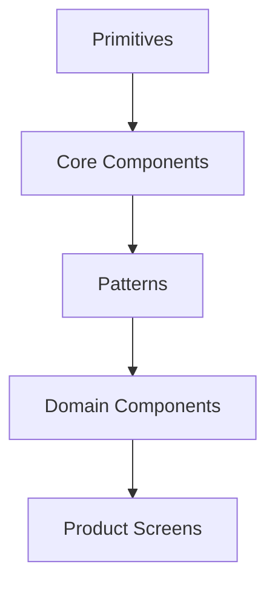

Do not put every repeated UI into the "core" package.

Use layers.



Example:

```text
Primitive:
  Popover

Core:
  Select

Pattern:
  SearchFilterBar

Domain:
  TransactionFilter

Product:
  TransactionsPage
```

This prevents the design system from becoming a giant product-specific dependency.
