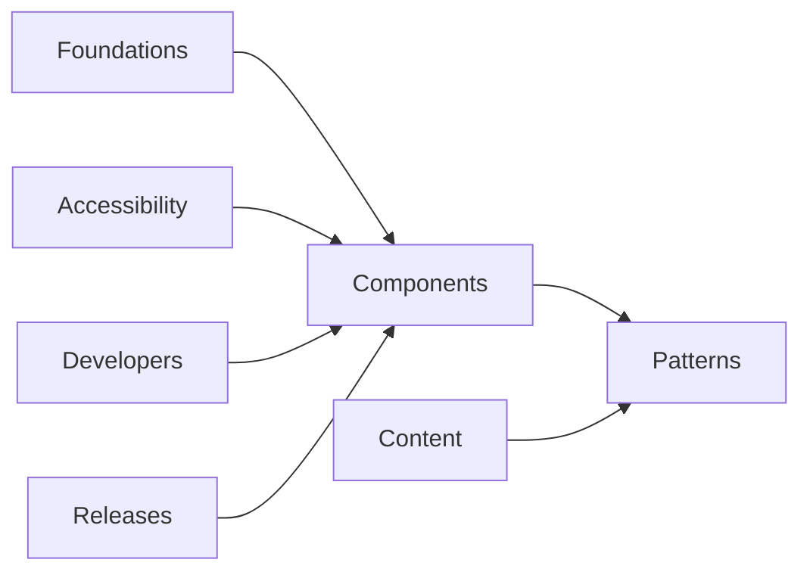

Documentation drives adoption.

A technically excellent component that nobody understands will be reimplemented.

Every component should document:

```text
Purpose
When to use
When not to use
Anatomy
Variants
Sizes
States
Behavior
Accessibility
Content guidance
Examples
API
Known constraints
Migration notes
```

---

## Documentation information architecture



---

## Storybook

Storybook is especially useful for:

- isolated component rendering
- variants
- states
- visual regression
- interactive tests
- accessibility checks
- documentation

Example story matrix:

```text
Button
├── Default
├── Variants
├── Sizes
├── Icons
├── Loading
├── Disabled
├── Long text
├── Dark background
└── RTL
```
