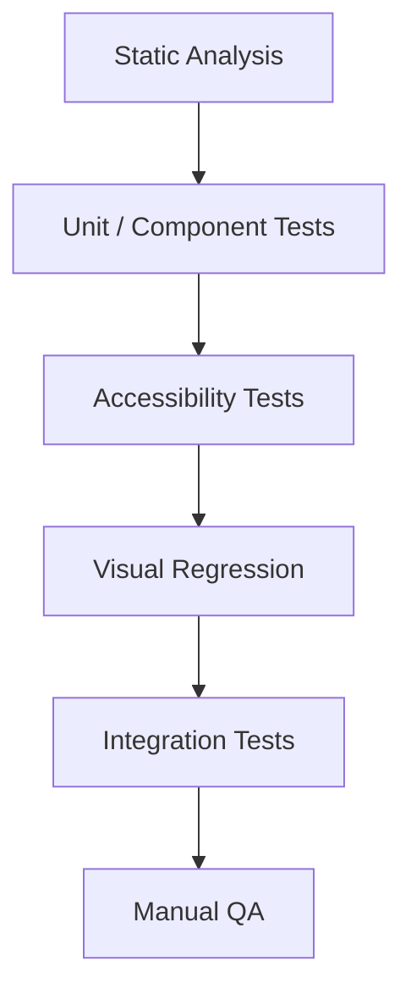

Design systems need unusually strong testing because one regression can affect many applications.

---

## Testing pyramid

## In this chapter

<Cards>
<Card title="22.1 Static analysis" href="/design-system-guide/testing-strategy/static-analysis" description="Testing Strategy · Section 22.1" />
<Card title="22.2 Unit and component tests" href="/design-system-guide/testing-strategy/unit-and-component-tests" description="Testing Strategy · Section 22.2" />
<Card title="22.3 Accessibility tests" href="/design-system-guide/testing-strategy/accessibility-tests" description="Testing Strategy · Section 22.3" />
<Card title="22.4 Visual regression" href="/design-system-guide/testing-strategy/visual-regression" description="Testing Strategy · Section 22.4" />
<Card title="22.5 Contract testing" href="/design-system-guide/testing-strategy/contract-testing" description="Testing Strategy · Section 22.5" />
</Cards>
