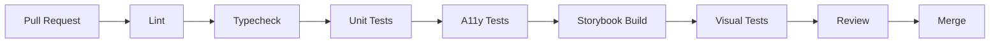

Typical checks:

```text
lint
format
typecheck
unit tests
accessibility tests
build
visual regression
bundle size
```

Example pipeline:


```mermaid
flowchart LR
    A[Pull Request]
    B[Lint]
    C[Typecheck]
    D[Unit Tests]
    E[A11y Tests]
    F[Storybook Build]
    G[Visual Tests]
    H[Review]
    I[Merge]

    A --> B --> C --> D --> E --> F --> G --> H --> I
```
