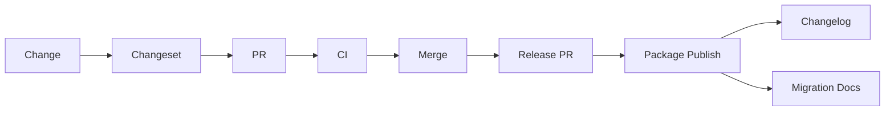

Use semantic versioning where applicable.

```text
MAJOR.MINOR.PATCH
```

### Patch

Bug fix without intended API break.

```text
2.4.1 -> 2.4.2
```

### Minor

Backward-compatible feature.

```text
2.4.2 -> 2.5.0
```

### Major

Breaking change.

```text
2.5.0 -> 3.0.0
```

---

## Release flow



Tools such as Changesets can automate package versioning in monorepos.

---

## Deprecation strategy

Never remove widely used APIs immediately.

Suggested lifecycle:

```text
Supported
   ↓
Deprecated
   ↓
Migration warning
   ↓
Replacement available
   ↓
Removed in major release
```
