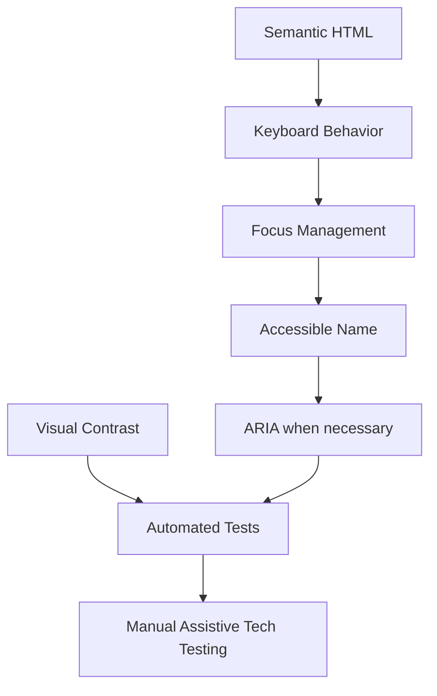

Accessibility must be architectural, not decorative.

The system should target at least a clearly defined accessibility baseline such as WCAG AA where applicable.

Key areas:

- semantic HTML
- keyboard navigation
- focus management
- screen reader labels
- color contrast
- reduced motion
- touch target size
- error identification
- form labeling
- live announcements

---

## Accessibility hierarchy

Important:

> ARIA does not replace semantic HTML.

A native `<button>` is almost always better than a clickable `
` with manually recreated keyboard semantics.
