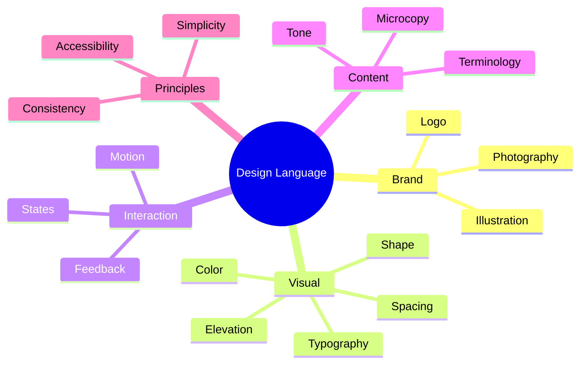

The design language defines how the product expresses itself.

## In this chapter

<Cards>
<Card title="9.1 Brand" href="/design-system-guide/creating-the-design-language/brand" description="Creating the Design Language · Section 9.1" />
<Card title="9.2 Vision" href="/design-system-guide/creating-the-design-language/vision" description="Creating the Design Language · Section 9.2" />
<Card title="9.3 Design principles" href="/design-system-guide/creating-the-design-language/design-principles" description="Creating the Design Language · Section 9.3" />
<Card title="9.4 Terminology" href="/design-system-guide/creating-the-design-language/terminology" description="Creating the Design Language · Section 9.4" />
<Card title="9.5 Tone of voice" href="/design-system-guide/creating-the-design-language/tone-of-voice" description="Creating the Design Language · Section 9.5" />
<Card title="9.6 Writing guidelines" href="/design-system-guide/creating-the-design-language/writing-guidelines" description="Creating the Design Language · Section 9.6" />
<Card title="9.7 Microcopy" href="/design-system-guide/creating-the-design-language/microcopy" description="Creating the Design Language · Section 9.7" />
</Cards>
