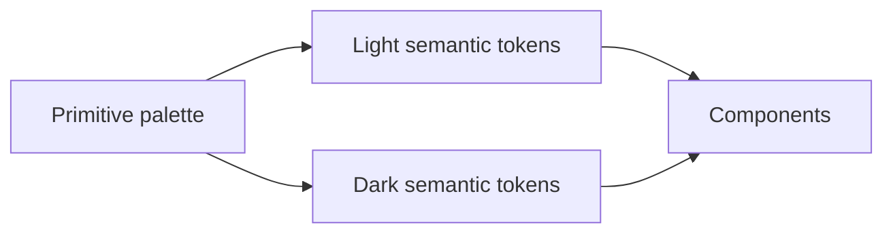

```mermaid
flowchart LR
    A[Primitive palette]
    B[Light semantic tokens]
    C[Dark semantic tokens]
    D[Components]

    A --> B
    A --> C
    B --> D
    C --> D
```

Components should prefer semantic tokens:

```css
background: var(--color-bg-surface);
color: var(--color-text-primary);
```

not:

```css
background: var(--white);
color: var(--gray-900);
```
