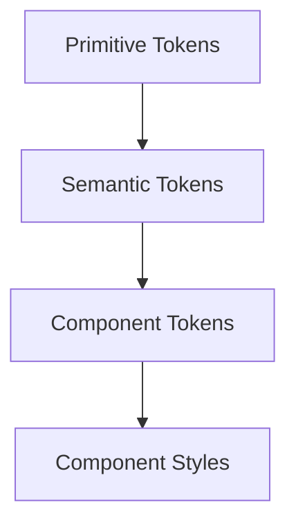

A robust model:



## Primitive tokens

Raw scales.

```text
blue.500
gray.100
space.4
radius.2
```

## Semantic tokens

Describe purpose.

```text
color.text.primary
color.text.danger
color.background.surface
color.border.muted
```

## Component tokens

Optional layer for component-specific decisions.

```text
button.primary.background
button.primary.text
button.primary.backgroundHover
```
