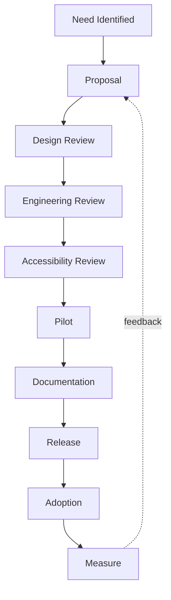

A design system must be easy to contribute to without becoming chaotic.

---

## Contribution proposal

A proposal should answer:

```text
Problem
Evidence
Existing workaround
Why existing components cannot solve it
Proposed API
Design
Accessibility behavior
Responsive behavior
Migration impact
Alternatives considered
```

---

## Governance workflow



---

## Component admission criteria

Before adding a new core component, ask:

- Is the use case repeated?
- Is it product-agnostic?
- Will at least multiple consumers use it?
- Can an existing component be extended?
- Is the interaction pattern understood?
- Can accessibility be solved reliably?
- Can the API remain stable?
