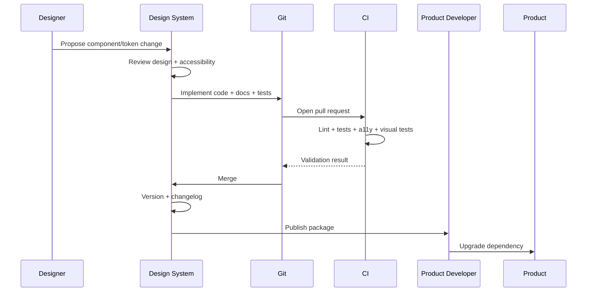
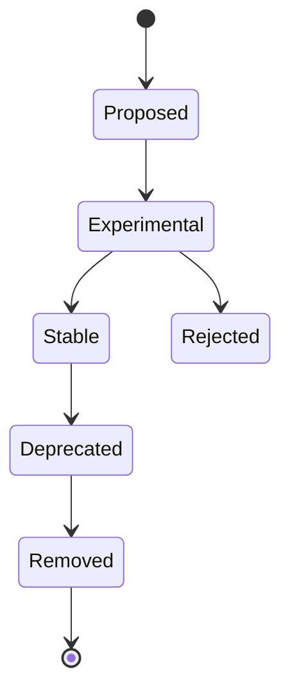

A mature flow from design decision to production:

```mermaid
sequenceDiagram
    participant D as Designer
    participant DS as Design System
    participant G as Git
    participant CI as CI
    participant DEV as Product Developer
    participant APP as Product

    D->>DS: Propose component/token change
    DS->>DS: Review design + accessibility
    DS->>G: Implement code + docs + tests
    G->>CI: Open pull request
    CI->>CI: Lint + tests + a11y + visual tests
    CI-->>G: Validation result
    G->>DS: Merge
    DS->>DS: Version + changelog
    DS->>DEV: Publish package
    DEV->>APP: Upgrade dependency
```

---

## Component lifecycle

```mermaid
stateDiagram-v2
    [*] --> Proposed
    Proposed --> Experimental
    Experimental --> Stable
    Experimental --> Rejected
    Stable --> Deprecated
    Deprecated --> Removed
    Removed --> [*]
```
