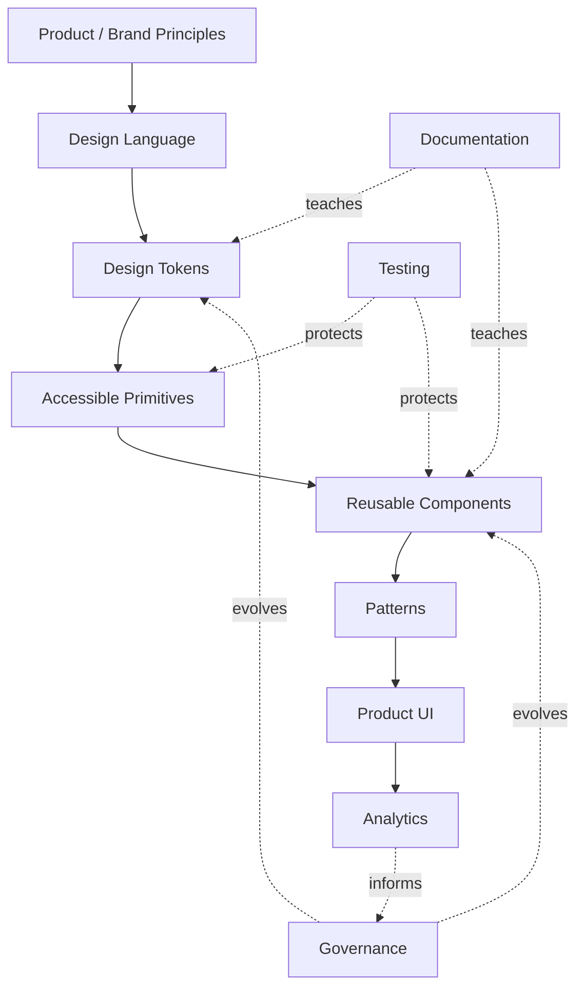

If you remember only one diagram, remember this:



A design system is not a folder full of UI components.

It is a **feedback-driven system for turning product decisions into reusable, documented, accessible, testable, and governable building blocks**.

---

## Suggested build exercise

Build a small production-style system with:

```text
Tokens
├── color
├── spacing
├── typography
├── radius
├── shadow
└── motion

Components
├── Button
├── Badge
├── Avatar
├── Input
├── Textarea
├── Checkbox
├── Radio
├── Switch
├── Select
├── Tooltip
├── DropdownMenu
├── Dialog
├── Tabs
└── Toast

Infrastructure
├── Storybook
├── Vitest
├── Testing Library
├── axe accessibility tests
├── Playwright
├── visual regression
├── Changesets
└── CI
```

Then build one real application screen entirely using the system.

That exercise will teach more than memorizing component names from a roadmap.
