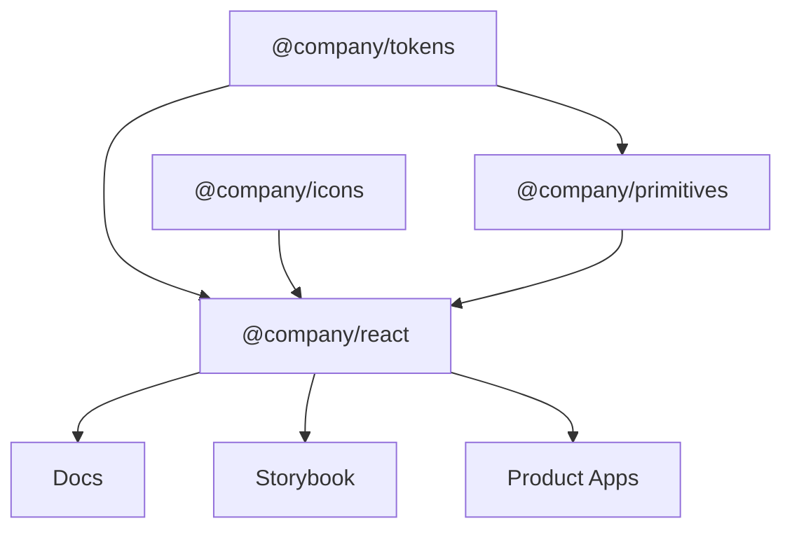

A practical monorepo might look like:

```text
design-system/
├── apps/
│   ├── docs/
│   └── storybook/
│
├── packages/
│   ├── tokens/
│   ├── primitives/
│   ├── react/
│   ├── icons/
│   ├── eslint-config/
│   └── typescript-config/
│
├── .changeset/
├── package.json
├── pnpm-workspace.yaml
└── turbo.json
```

---

## Package relationships



---

## Token package

Outputs might include:

```text
dist/tokens.css
dist/tokens.json
dist/tokens.ts
```

---

## React package

Example structure:

```text
src/
├── button/
│   ├── button.tsx
│   ├── button.test.tsx
│   ├── button.stories.tsx
│   └── index.ts
│
├── dialog/
├── input/
└── index.ts
```

---

## CSS strategy

Possible options:

- plain CSS
- CSS Modules
- Tailwind
- vanilla-extract
- Panda CSS
- CSS-in-JS

There is no universally correct answer.

Important requirements:

- token usage
- predictable styling
- theming
- SSR compatibility if needed
- low runtime cost
- consumer ergonomics
