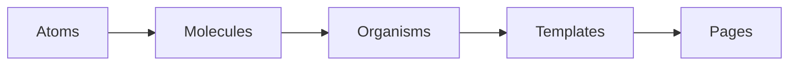

Brad Frost's Atomic Design is a mental model for understanding composition.

Classic levels:

Examples:

### Atoms

- Button
- Icon
- Text
- Input

### Molecules

- SearchField
- FormField
- AvatarLabel

### Organisms

- Navbar
- CheckoutSummary
- DataTable

### Templates

- Dashboard layout
- Checkout layout
- Settings layout

### Pages

Real data rendered into templates.

---

## Important caveat

Atomic Design is useful for thinking, but component architecture should be based on **responsibility and reuse**, not forced taxonomy.

Do not waste time arguing whether something is technically a "molecule" or an "organism."

The useful question is:

> What responsibility does this abstraction own, and where should that responsibility live?
