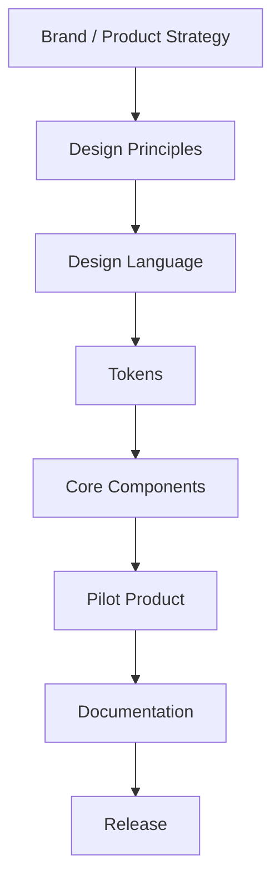
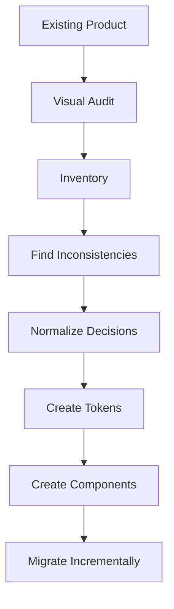

## From scratch

If the product is new:

You can skip the large-scale visual audit because no legacy UI exists.

---

## From existing product

For an existing product:

This path is often harder because you are replacing many undocumented decisions.
