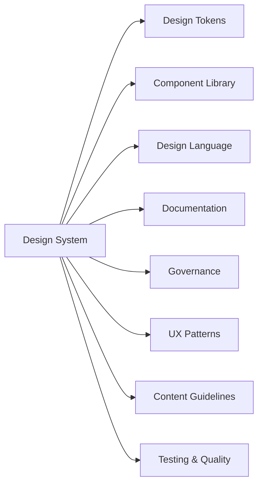

A **component library** is one implementation layer of a design system.

A design system additionally includes:

- rationale
- principles
- accessibility requirements
- usage guidance
- content guidance
- tokens
- design assets
- contribution rules
- versioning
- governance
- release strategy
- documentation

You can have a component library without a true design system.

A healthy design system almost always includes one or more component libraries.
