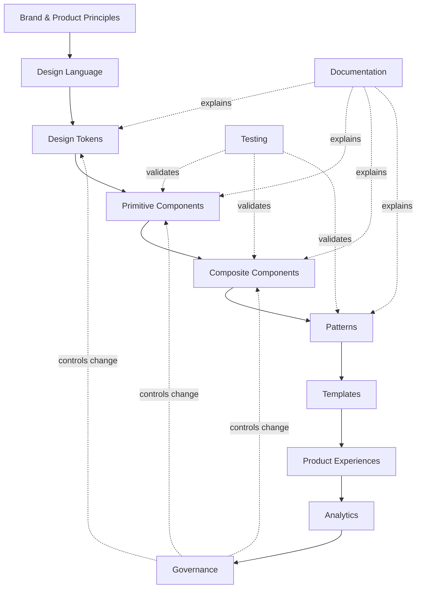

A design system is a **shared product-design infrastructure**.

It is not just a Figma file.

It is not just a React component library.

It is not just a collection of colors and fonts.

A mature design system connects:

- brand
- product design
- UX principles
- content rules
- design tokens
- reusable components
- accessibility
- engineering conventions
- documentation
- testing
- releases
- contribution workflows
- governance
- analytics

A useful mental model is:

The design system sits **between product intent and product implementation**.
