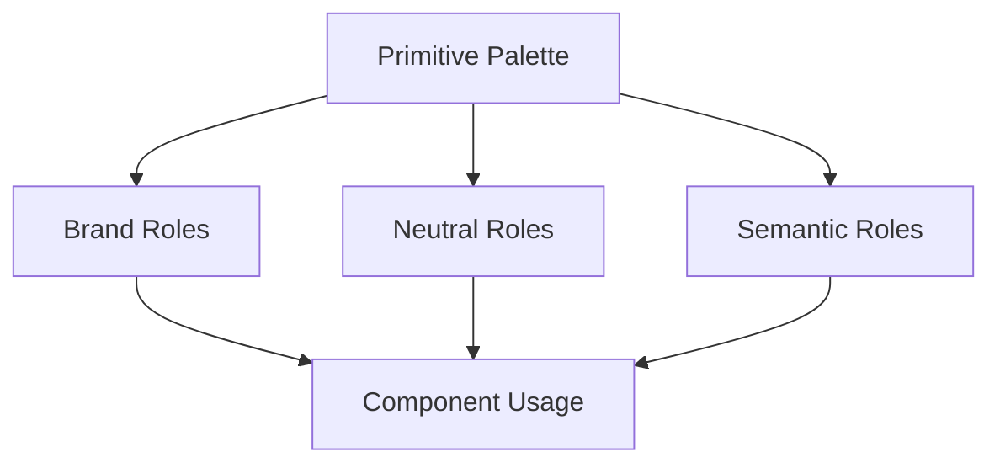

Color is both brand expression and functional communication.

A useful architecture:

## In this chapter

<Cards>
<Card title="13.1 Functional colors" href="/docs/color-system/functional-colors" description="Color System · Section 13.1" />
<Card title="13.2 Dark mode" href="/docs/color-system/dark-mode" description="Color System · Section 13.2" />
<Card title="13.3 Contrast" href="/docs/color-system/contrast" description="Color System · Section 13.3" />
</Cards>
