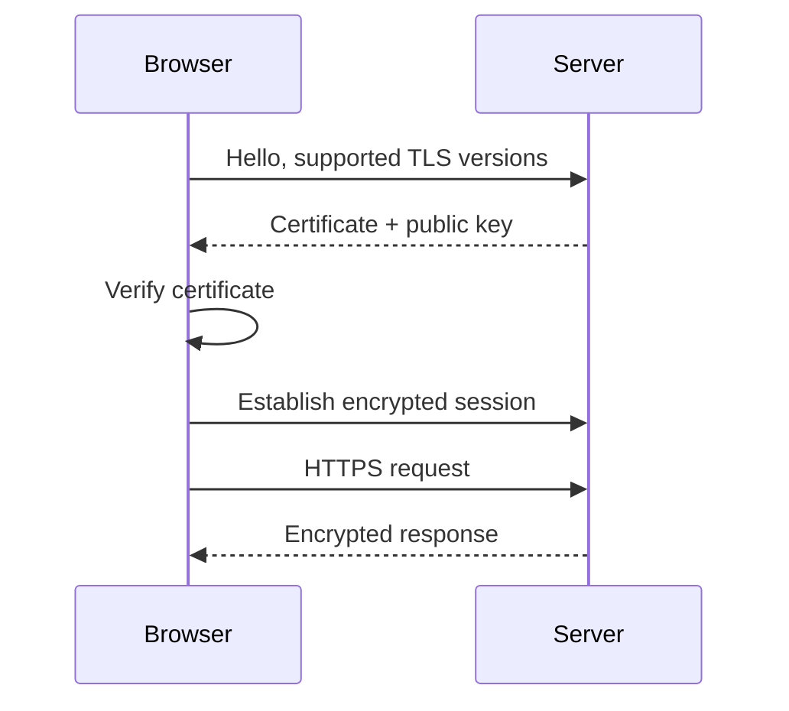

The formula to start with:

```text
HTTP + TLS = HTTPS
```

HTTPS is not a different protocol. It is ordinary HTTP carried inside an
encrypted TLS session. Everything you know about methods, headers and status
codes is unchanged; it just cannot be read or modified in transit.

You do not need the cryptography to work with this productively. You need to
know what a certificate proves, who issues it, and where in your infrastructure
the encryption stops.

## What the handshake does



Three things come out of it:

**Encryption** — nobody between the browser and server can read the traffic.
**Integrity** — nobody can modify it undetected. **Identity** — the server has
proven it controls the domain.

That third one is the part people forget. The padlock means "this really is
`example.com`". It says nothing about whether `example.com` is trustworthy.

## Certificates and who signs them

A certificate binds a domain name to a public key, signed by a Certificate
Authority the browser already trusts. Browsers ship with a list of trusted CAs;
the chain from your certificate up to one of those roots is what gets verified.

This is why self-signed certificates produce warnings. The cryptography is fine
— nothing vouches for the identity.

**Let's Encrypt** made certificates free and automatable, which is why HTTPS
went from "a thing you bought for the checkout page" to universal. Certificates
are short-lived (90 days) by design, which forces automated renewal.

Most renewal incidents are automation that quietly stopped working months
earlier and was only noticed at expiry. If you run your own certificates, alert
on *days remaining*, not on failure.

## TLS termination

The most important operational concept here: TLS usually does not run all the
way to your application.

```text
Browser ══encrypted══> CDN / Load Balancer ──plain──> Your app
```

The edge decrypts, inspects and routes, then talks to your app over the internal
network. This is called **TLS termination**, and it has consequences you will
meet in practice:

- Your app sees plain HTTP and may generate `http://` URLs or redirect loops
  unless it trusts the `X-Forwarded-Proto` header.
- The client IP your app sees is the proxy's, not the user's — hence
  `X-Forwarded-For`.
- Certificate configuration lives at the edge, not in your application code.

Covered again from the proxy side in
[Reverse Proxies](/frontend-infrastructure/reverse-proxies).

## Certificates and subdomains

A certificate is valid for the names listed in it. `example.com` and
`app.example.com` are different names, so a certificate for one does not cover
the other unless both are listed.

A **wildcard certificate** for `*.example.com` covers any single-level
subdomain, which pairs with the wildcard DNS from the previous page. Wildcards
require proving domain control via DNS rather than HTTP, which is why they need
API access to your DNS provider to automate.

<Callout>
If a custom domain shows a certificate error immediately after setup, it is
usually not broken — issuance requires a successful domain validation, which
requires the DNS record to have resolved first. Fix DNS, then wait.
</Callout>

## Mixed content

A page loaded over HTTPS that requests an `http://` subresource has its request
blocked by the browser. This is the other common "it works locally" failure:
locally everything is HTTP, so nothing is mixed.

The fix is to make every URL your app emits protocol-relative or explicitly
HTTPS — including ones built from environment variables, which is where they
usually hide.

## What to learn next

Enough TLS for now. The next chapter puts it to work: a
[reverse proxy](/frontend-infrastructure/reverse-proxies) is where certificates,
routing and termination all meet in one config file.
