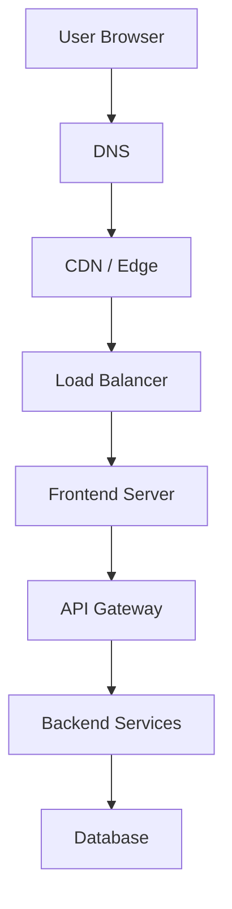
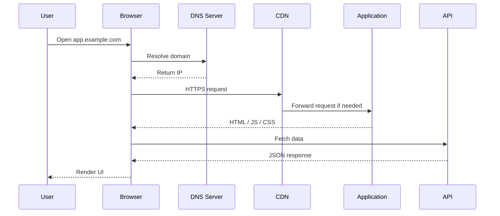

When a user opens `https://app.example.com`, a lot happens before any of your
code runs. Most infrastructure knowledge is just filling in this diagram.

Each box is a place where the request can be cached, redirected, rejected,
rewritten or dropped. Each box also logs separately, which is why "the site is
broken" is not a debuggable statement until you know which hop failed.

## The request lifecycle

In more detail, with the browser doing most of the work:

Note the shape of it. The browser makes *two distinct kinds* of request: one for
the documents and assets, one for data. They often travel different paths, hit
different caches and fail for different reasons. A page that renders but shows
no data has a working delivery path and a broken API path — already half the
debugging done.

## The interview question that is actually useful

> What exactly happens after I type a URL and press Enter?

This is a cliché interview question, and it is also the single best organizing
question for infrastructure. A complete answer touches DNS, TCP, TLS, HTTP,
caching, proxies, rendering and the browser's own networking — which is most of
this chapter and the next.

You are not expected to answer it fully yet. Come back to it after
[Caching](/frontend-infrastructure/caching) and see how much more of it you can
fill in.

## Where things go wrong

A rough map of which layer owns which symptom:

| Symptom | Usually owned by |
| --- | --- |
| Domain does not resolve at all | [DNS](/frontend-infrastructure/dns) |
| Certificate warning in the browser | [TLS](/frontend-infrastructure/https-and-tls) |
| Old JavaScript after a deploy | [Caching](/frontend-infrastructure/caching) / CDN |
| 502 / 504 errors | [Reverse proxy](/frontend-infrastructure/reverse-proxies) or upstream app |
| CORS error | The [API](/frontend-infrastructure/api-gateways)'s response headers |
| Works locally, fails deployed | [Environment config](/frontend-infrastructure/environment-variables-and-secrets) |
| Logged out on every other request | Load balancer / session handling |

That table is worth more than it looks. Most of the time spent on an incident is
spent deciding which box to open.
