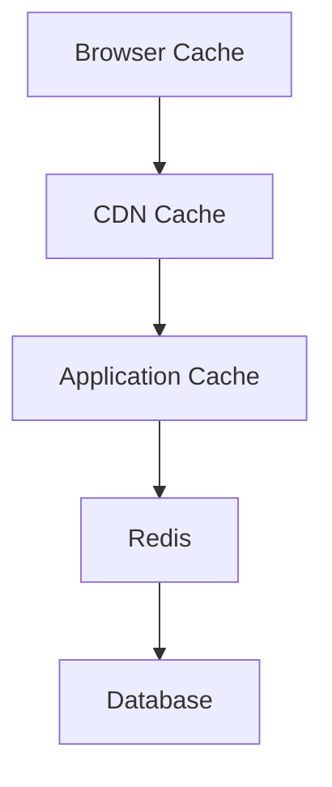

Caching is the highest-value infrastructure topic for frontend work, and the one
with the most ways to get subtly wrong. A stale cache is worse than no cache: it
serves confidently incorrect data and cannot be debugged from the browser.

The first thing to internalize is that there is not one cache. There are
several, in series, each obeying its own rules:



A request stops at the first layer that can answer. Debugging means finding
which layer answered — and the browser cache in particular is invisible from the
server, which is why "I cleared my cache and it works now" is such a common and
unhelpful bug report.

## The headers

```text
Cache-Control             the main control
  max-age=N               browser may cache N seconds
  s-maxage=N              shared caches use this instead
  public / private        may a CDN cache it, or only the browser
  no-cache                cache, but revalidate before each use
  no-store                do not write it down at all
  immutable               never revalidate; it cannot change
  stale-while-revalidate=N  serve stale, refresh in background

ETag                      version identifier for revalidation
Last-Modified             timestamp alternative to ETag
```

Two easily confused ones: `no-cache` *does* cache and revalidates each time;
`no-store` is the one that means "do not keep this anywhere". Use `no-store` for
anything containing personal data.

## The two-policy pattern

Nearly every correct frontend caching setup is the same two rules.

**Hashed assets — cache forever.**

```http
Cache-Control: public, max-age=31536000, immutable
```

Safe because the filename changes when the content does:

```text
app.81acdd2.js
styles.c410234.css
```

`immutable` is the valuable part: it tells the browser not to even send a
revalidation request on reload, eliminating a round trip per asset.

**HTML — cache briefly, revalidate always.**

```http
Cache-Control: public, max-age=0, must-revalidate
```

The document is what points at the current asset filenames, so it must never be
stale. A long-cached HTML file referencing deleted asset hashes is the classic
"site broken after deploy" incident.

## stale-while-revalidate

The middle ground, and a genuinely excellent default for CDN-cached documents:

```http
Cache-Control: public, s-maxage=60, stale-while-revalidate=600
```

For 60 seconds, serve from cache. For the next 600, serve the stale copy
*immediately* and refresh in the background. Users always get a fast response;
the content is at most a few minutes old. No user ever waits for the origin.

## Revalidation

When a cached entry expires, the client does not re-download blindly. It asks
whether anything changed:

```http
GET /api/products
If-None-Match: "abc123"
```

If the ETag still matches, the server answers `304 Not Modified` with no body.
The round trip still costs latency, but the bytes are saved. This is why
`immutable` matters for assets — it skips even this.

## Cache keys and the invisible variable

A cache entry is keyed by more than the URL. `Vary` adds request headers to the
key:

```http
Vary: Accept-Encoding
```

Correct — a gzip and a Brotli response are different bytes. But `Vary: Cookie`
effectively disables shared caching entirely, since every user has a different
cookie. Frameworks add this automatically when a response touches the session,
which is a frequent cause of a CDN that never reports a HIT.

<Callout>
Query strings are usually part of the cache key too. Analytics parameters like
`?utm_source=` can fragment your cache into thousands of copies of the same
page. Most CDNs let you strip or ignore specified parameters — worth
configuring.
</Callout>

## Where to cache

A rough guide for frontend-adjacent responses:

| Content | Policy |
| --- | --- |
| Hashed JS/CSS/fonts | `max-age=31536000, immutable` |
| Unhashed images | `max-age=86400` |
| HTML documents | `s-maxage=60, stale-while-revalidate` |
| Public API reads | short `s-maxage`, ETag |
| Anything user-specific | `private, no-store` |

The last row is not optional. A personalized response cached by a shared proxy
gets served to the wrong user, and that is a data breach rather than a
performance bug.
