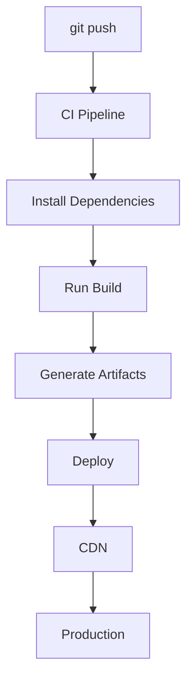
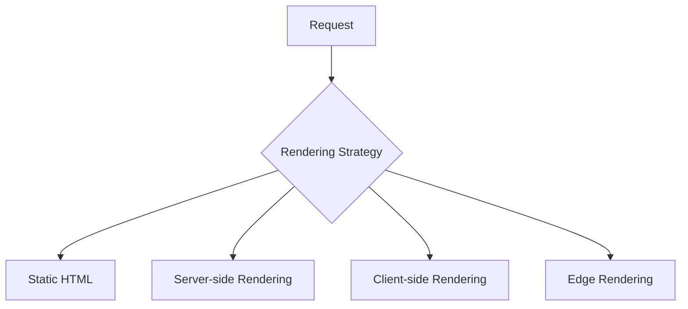

Do not stop at:

```bash
vercel deploy
```

That command is excellent and you should keep using it. But it compresses about
six infrastructure steps into one word, and when something goes wrong you are
debugging a black box.

## What a platform does on your behalf



Plus several things that are easy not to notice: provisioning a TLS certificate
for the domain, uploading static assets to a CDN with correct cache headers,
starting a server runtime for anything dynamic, keeping the previous deployment
alive until the new one is healthy, and giving every branch its own preview URL.

Each of those is a chapter of this handbook. That is the trade being made —
convenience for visibility.

## Immutable deployments

The concept underneath modern deployment platforms, and worth stealing even if
you host yourself.

A deployment is never modified. Each build produces a complete, immutable
artifact at its own address, and "promoting to production" just points the
domain at a different artifact.

Consequences that matter in practice:

- **Rollback is instant** — repoint the alias at the previous artifact. No
  rebuild, no redeploy.
- **Preview URLs are free** — every build is already addressable.
- **Assets never conflict** — old hashed files stay reachable, so users on the
  previous version do not get 404s mid-session.

That last point is subtle and important. If you deploy by overwriting a
directory, anyone with the old HTML open requests asset filenames that no longer
exist. Keeping old artifacts around for a while prevents it.

## Rendering strategies

The choice that most affects your infrastructure, made in application code:



**Static (SSG)** — HTML generated at build time. Cacheable at the edge
indefinitely, needs no server, and is the fastest and cheapest option by a wide
margin. Content changes require a rebuild.

**Client-side (SPA)** — a near-empty HTML shell, then JavaScript fetches and
renders. Also just static files, but the data round trip happens after the
bundle loads and parses, which is bad for first paint and bad for SEO.

**Server-side (SSR)** — HTML built per request. Always fresh, personalizable,
and it needs a running server that scales with traffic. The document is no
longer cacheable by default, which changes your whole caching story.

**ISR** — static, but regenerated in the background on a schedule or on demand.
Most of the performance of SSG with most of the freshness of SSR.

**Edge rendering** — SSR in a CDN point of presence rather than one region.
Removes the geographic penalty from dynamic pages, at the cost of a constrained
runtime and no cheap database access (your database is still in one region).

<Callout>
These are per-route decisions, not per-application. A marketing page should be
static, a dashboard should not, and they can live in the same app. Frameworks
that force one strategy across the whole application are making an
infrastructure decision on your behalf.
</Callout>

## Deploy the same app several ways

The single best exercise in this chapter. Take one small app and ship it four
ways:

```text
1.  Vercel
2.  Cloudflare Pages
3.  S3 + CloudFront
4.  VPS → Docker → Nginx → your app
```

Option 1 takes minutes. Option 4 takes a weekend and teaches you what the other
three were doing: you will configure the certificate, write the
[proxy rules](/frontend-infrastructure/reverse-proxies), set the
[cache headers](/frontend-infrastructure/caching) by hand, and discover what
happens when you forget one.

After that, managed platforms stop being magic and become a decision with known
trade-offs — which is exactly the position you want to argue from when someone
proposes migrating.
