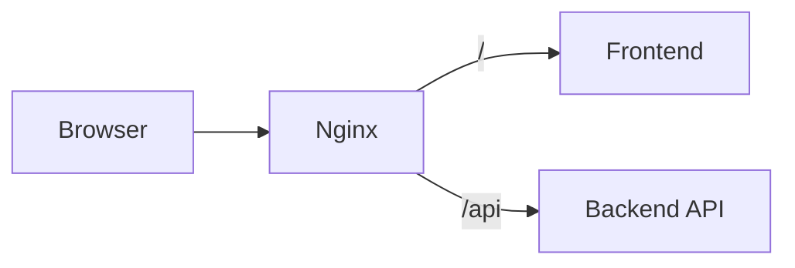
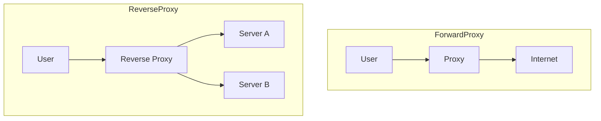

Learn Nginx, even if you never configure one in anger. Reverse proxies are the
component that explains the largest number of otherwise inexplicable behaviours:
why the API is on the same domain, why your app thinks every request is HTTP,
why WebSockets fail in production only.

A reverse proxy sits in front of one or more servers and forwards requests to
them. To the browser, it *is* the server.



```nginx
server {
    listen 443 ssl;

    location / {
        proxy_pass http://frontend:3000;
    }

    location /api {
        proxy_pass http://backend:4000;
    }
}
```

Two services, one origin, no CORS. That last point is worth dwelling on: much of
the CORS configuration people write exists only because the frontend and API
were put on different origins when a path prefix would have done.

## Forward vs reverse

The same machinery, pointed in opposite directions:



A **forward proxy** represents the *client* — corporate egress filtering, VPNs.
The server does not know who the real client is.

A **reverse proxy** represents the *server* — the client does not know which
backend answered, or how many there are.

## What it is actually for

**TLS termination.** One place holds the certificate. Backends speak plain HTTP
internally. See [HTTPS and TLS](/frontend-infrastructure/https-and-tls).

**Routing.** Path or hostname decides which service handles the request.

**Serving static files.** Nginx serves assets from disk far more efficiently
than a Node process will.

**Compression, redirects, headers.** Cross-cutting concerns applied once instead
of in every service.

**Hiding topology.** Backends move, scale and get replaced without the client
noticing.

## The header problem

Proxying loses information unless you explicitly preserve it. This is the single
most common source of proxy bugs:

```nginx
location / {
    proxy_pass http://frontend:3000;

    proxy_set_header Host              $host;
    proxy_set_header X-Real-IP         $remote_addr;
    proxy_set_header X-Forwarded-For   $proxy_add_x_forwarded_for;
    proxy_set_header X-Forwarded-Proto $scheme;
}
```

Without these, your application sees a request to `frontend:3000` over HTTP from
the proxy's IP. The symptoms are distinctive once you know them:

- Redirects that send users to `http://frontend:3000/login`
- Infinite redirect loops between HTTP and HTTPS
- Every user appearing to come from the same IP in your logs
- Rate limiting that blocks everyone at once

Frameworks need telling to trust these headers — Next.js does it by default
behind a known proxy, Express needs `app.set('trust proxy', true)`. Trusting
them when you are *not* behind a proxy is a security hole, since clients can
then spoof their own IP.

## WebSockets need opting in

An upgrade request is an ordinary HTTP request with headers that must survive
the hop:

```nginx
location /ws {
    proxy_pass http://backend:4000;

    proxy_http_version 1.1;
    proxy_set_header Upgrade    $http_upgrade;
    proxy_set_header Connection "upgrade";

    proxy_read_timeout 3600s;
}
```

The timeout matters as much as the upgrade headers. Default proxy timeouts are
around 60 seconds, so an idle socket is closed by the proxy and the client sees a
mysterious disconnect roughly every minute.

<Callout>
Nginx is the classic choice, but the concepts transfer directly. Caddy does
automatic HTTPS with far less config, Traefik discovers containers
automatically, and Envoy is what sits underneath most service meshes. Learn the
model once.
</Callout>
