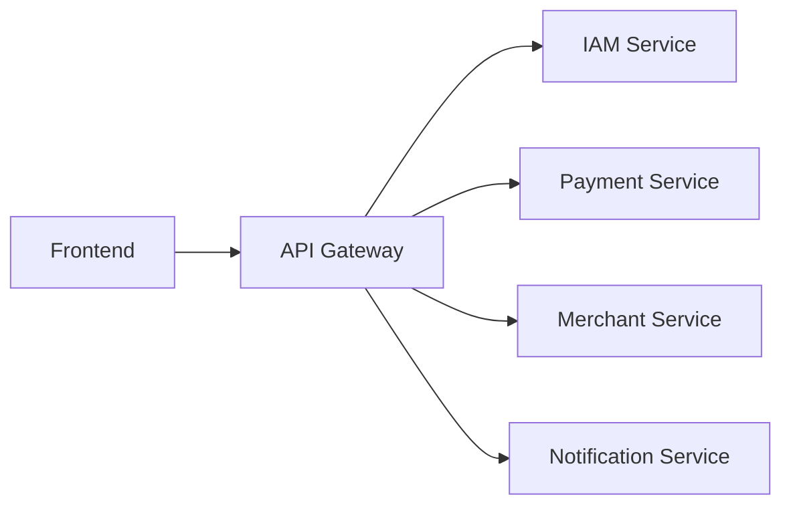

Modern applications rarely talk to a single backend. An API gateway gives the
frontend one address and one set of rules, hiding however many services sit
behind it.



Without one, the frontend needs to know every service's address, implement auth
against each, and handle CORS for all of them. Services become directly coupled
to clients and cannot be split or moved without breaking them.

## What belongs in the gateway

Cross-cutting concerns that would otherwise be reimplemented in every service:

**Routing** — path or host decides the destination. `/api/payments/*` goes to
the payment service.

**Authentication** — validate the token or session once, at the edge. Services
receive an already-authenticated request with the user identity attached, and
never see raw credentials.

**Rate limiting** — per user, per IP, per endpoint, applied before the request
costs anything downstream.

**Request IDs** — attach a correlation ID that follows the request through every
service. This is what makes
[distributed tracing](/frontend-infrastructure/distributed-tracing) possible.

**Logging and metrics** — one consistent place where every request is recorded.

**Versioning** — route `/v1` and `/v2` to different implementations during a
migration.

Authorization is the interesting case: the gateway can check *that* you are
authenticated, but whether you may modify *this particular invoice* is a
business rule that belongs in the service that owns invoices.

## Gateway vs load balancer vs reverse proxy

These overlap enough to be genuinely confusing, and often the same software does
all three.

```text
Reverse proxy   forwards requests to backends; the base mechanism
Load balancer   distributes across identical instances; about capacity
API gateway     routes to different services and applies API policy
```

The distinction is intent, not technology. Nginx can do all three. An API
gateway is the layer that knows about *APIs* — tokens, rate limits, versions —
rather than just about hosts and ports.

## What this changes for the frontend

Three practical consequences.

**One origin.** If the gateway sits on the same domain as your app, CORS stops
being your problem entirely.

**Consistent errors.** The gateway can normalize failures so the client is not
writing per-service error handling. It also means a `401` might come from the
gateway rather than the service — worth knowing when debugging.

**New failure modes.** A rate limit returns `429` with a `Retry-After` header
that your client should respect rather than immediately retrying. And the
gateway itself is a single point of failure, which is why it is usually run
behind a [load balancer](/frontend-infrastructure/load-balancers) with several
instances.

## The BFF pattern

Backend for Frontend: a gateway-like service owned by the frontend team, shaped
to what the UI actually needs.

A screen that requires data from four services means four round trips from the
browser, each paying full network latency. A BFF makes those calls server-side
on a fast internal network and returns one response shaped for that screen.

```text
Browser → BFF → [ four services, in parallel, internally ]
```

Useful when mobile and web need different shapes of the same data, or when the
number of round trips is hurting perceived performance. It is also where GraphQL
usually sits.

The cost is another service to own, deploy and monitor — and a tendency for
business logic to migrate into it, which is the thing to watch for.

<Callout>
If you are on Next.js or a similar framework, route handlers and server
components already give you a BFF. Server-side data fetching that aggregates
several APIs and returns exactly what the page needs *is* this pattern, without
a separate deployment.
</Callout>
