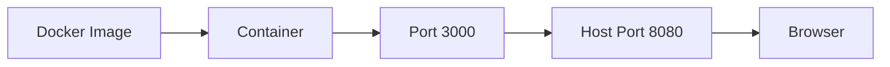

Do not start with Kubernetes. Kubernetes orchestrates containers, and
orchestrating something you do not understand is not a productive place to begin.

Docker solves a specific problem: "works on my machine". It packages the
application *and* its runtime, system libraries and configuration into one
artifact that runs the same way everywhere.

## Images and containers

The distinction people blur, and the source of a lot of confusion:

An **image** is a read-only template — a filesystem snapshot plus metadata about
how to start it. A **container** is a running instance of an image. One image,
many containers, like a class and its instances.



Images are built in layers, each instruction adding one. Layers are cached and
shared, which is why the second build is fast and why instruction order matters
a great deal.

## Port mapping

```bash
docker run -p 8080:3000 my-app
```

Reads as `host:container`:

```text
localhost:8080
      ↓
container:3000
```

The container has its own network namespace. Nothing inside it is reachable
until you publish a port.

## The localhost problem

This deserves its own section because it costs every developer at least one
afternoon.

Inside a container, `localhost` means **this container**. Not your Mac. Not the
host. Not the other container.

```text
localhost  →  this container, and nothing else
```

So a containerized app configured with `DATABASE_URL=postgres://localhost:5432`
will fail to connect even though Postgres is definitely running — because it is
running somewhere else, and `localhost` inside the container is an empty machine
with nothing on port 5432.

The fixes, depending on what you are reaching:

```text
Another container   →  use its service name (see next page)
The host machine    →  host.docker.internal (macOS/Windows)
```

## A frontend Dockerfile

Starting simple:

```dockerfile
FROM node:22-alpine

WORKDIR /app

COPY package*.json ./

RUN npm ci

COPY . .

RUN npm run build

EXPOSE 3000

CMD ["npm", "start"]
```

The ordering is deliberate, and it is the main thing to learn about Dockerfiles.
`package*.json` is copied and dependencies installed *before* the source is
copied. Layers are cached until an input changes, so editing a component
invalidates only the last two layers — dependencies are not reinstalled. Copy
the source first and every build reinstalls everything.

## Multi-stage builds

The Dockerfile above ships the entire build toolchain to production. The source,
devDependencies and compiler are all in the final image, which is both large and
a larger attack surface.

Multi-stage builds fix this by copying only the output into a clean final image:

```dockerfile
FROM node:22-alpine AS builder
WORKDIR /app
COPY package*.json ./
RUN npm ci
COPY . .
RUN npm run build

FROM node:22-alpine AS runner
WORKDIR /app
ENV NODE_ENV=production

COPY package*.json ./
RUN npm ci --omit=dev

COPY --from=builder /app/.next ./.next
COPY --from=builder /app/public ./public

EXPOSE 3000
CMD ["npm", "start"]
```

Only the named stage's artifacts cross over. For a static site, the second stage
can be Nginx with no Node at all — often a ~20MB image instead of ~400MB.

## Build-time vs runtime

A distinction that bites frontend apps specifically.

Anything baked into your JavaScript bundle is fixed at **build time**. Passing a
different environment variable at `docker run` will not change it — the value
was inlined into the bundle during `npm run build`.

```dockerfile
ARG NEXT_PUBLIC_API_URL
ENV NEXT_PUBLIC_API_URL=$NEXT_PUBLIC_API_URL
RUN npm run build
```

This means one image per environment for client-side config, which undermines
the "build once, deploy everywhere" principle. The alternative is fetching
public config at runtime from an endpoint. See
[Environment Variables and Secrets](/frontend-infrastructure/environment-variables-and-secrets).

<Callout>
Always add a `.dockerignore`. Without one, `COPY . .` sends `node_modules`,
`.git` and `.next` into the build context — slow builds, bloated images, and
host `node_modules` with the wrong native binaries overwriting the container's.
</Callout>

## The vocabulary

```text
image          the template
container      a running instance
registry       where images are stored and pulled from
volume         persistent storage outside the container's filesystem
layer          one cached step of an image build
```

Containers are ephemeral. Anything written inside one disappears when it is
replaced, which is fine for a frontend server and fatal for a database —
that is what volumes are for.
