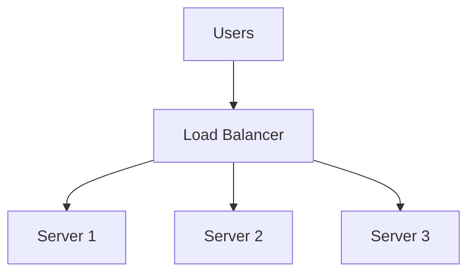
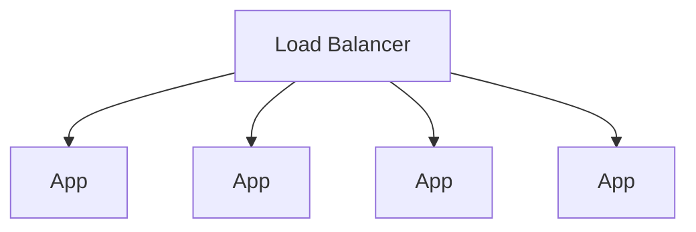

Once [reverse proxies](/frontend-infrastructure/reverse-proxies) make sense, load
balancing is a small step: the same idea, with several identical backends
instead of several different ones.



Two things come out of it. **Capacity**, because traffic spreads across
machines. **Availability**, because any one machine can die without taking the
site down.

## Horizontal vs vertical

Instead of one large machine:

```text
1 server
16 CPU
```

run several smaller ones:

```text
4 servers
4 CPU each
```



Same total capacity, but no single point of failure, and you can add or remove
instances with demand rather than provisioning for the annual peak.

The catch is that horizontal scaling imposes a constraint on your application,
and it is one frontend and full-stack developers regularly trip over.

## Your app must be stateless

Requests from one user can land on any instance. Anything stored in a single
server's memory is invisible to the others.

```text
In-memory sessions     →  logged out on every other request
Uploaded files on disk →  present on one server, 404 on the rest
In-process cache       →  three servers, three different answers
Rate limit counters    →  limit effectively multiplied by instance count
```

The fix in each case is to move the state somewhere shared: sessions and caches
into Redis, uploads into
[object storage](/frontend-infrastructure/object-storage), counters into a
shared store. This is the single most important architectural implication of
running more than one instance.

## Health checks

The load balancer polls each instance and removes any that stop answering
correctly:

```text
GET /health  →  200  →  keep sending traffic
GET /health  →  500  →  take it out of rotation
```

A good health endpoint is honest about dependencies — if the app cannot reach
its database it is not healthy, even though the process is alive. A bad health
check returns `200` unconditionally, which means a broken instance keeps
receiving traffic.

Do not make it too strict either: if a slow dependency makes every instance
report unhealthy simultaneously, the load balancer removes all of them and takes
down a site that was merely degraded.

## Distribution algorithms

```text
round robin         each server in turn; the default
least connections   whoever is least busy; better for uneven request cost
IP hash             same client → same server, deterministically
```

Round robin is fine for typical stateless web traffic. Least connections is
better when some requests are much more expensive than others, such as a mix of
fast page loads and long report generation.

## Sticky sessions

Sticky sessions pin a user to one instance, usually via a cookie. They exist to
let stateful applications scale horizontally without being fixed.

They are a workaround rather than a solution. That instance is now a single
point of failure for those users, load distributes unevenly, and deploying means
dropping sessions. Prefer shared session storage and keep stickiness for cases
you genuinely cannot avoid — such as long-lived WebSocket connections.

## WebSockets and long connections

Persistent connections change the calculus. A connection is assigned once and
held for hours, so "balance" drifts: a freshly deployed instance can sit idle
while older ones hold thousands of sockets.

Three things to configure:

- **Idle timeout** longer than your heartbeat interval, or the balancer closes
  quiet connections.
- **Connection draining** on deploy, so existing sockets finish instead of being
  cut.
- **A shared pub/sub layer** (usually Redis), because a message published on one
  instance must reach subscribers connected to another.

<Callout>
L4 vs L7 is worth knowing by name. A layer 4 balancer routes by IP and port and
knows nothing about HTTP. A layer 7 balancer reads the request and can route by
path, host or header, terminate TLS and rewrite headers. AWS's NLB is L4, ALB is
L7; for frontend work you almost always want L7.
</Callout>
