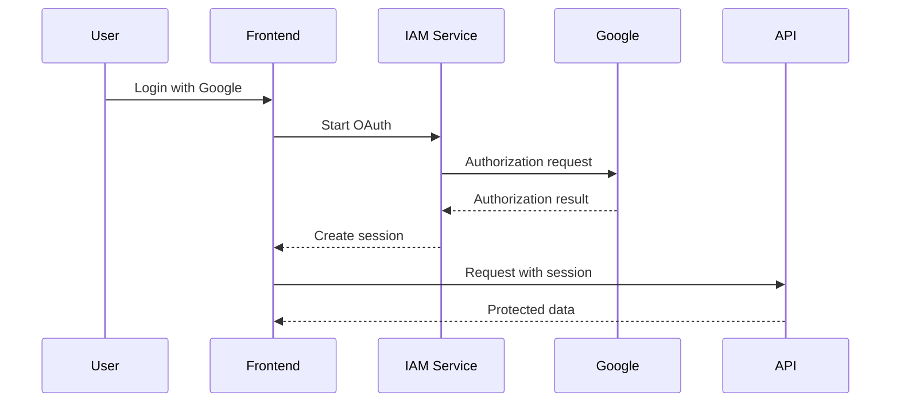

Authentication is arguably the best infrastructure topic for a frontend
engineer, because you own so much of it: the login UI, the token storage
decision, the refresh logic, the redirect handling, and every bug that comes
from getting those wrong.

Start with the distinction that organizes everything else:

```text
Authentication   who are you
Authorization    what may you do
```

## Sessions vs tokens

The two models, and the trade-off between them.

**Session** — the server stores the session, the browser holds an opaque ID in a
cookie. Revocation is trivial (delete the record), but every request needs a
lookup, and the store must be shared across
[instances](/frontend-infrastructure/load-balancers).

**Token (JWT)** — the claims are in the token itself, signed. Any server can
verify it with no lookup, which scales well across services. The cost is that
you cannot un-issue it: a stolen token is valid until it expires.

That last point drives the whole design of the next section.

## Access and refresh tokens

The standard resolution of the revocation problem:

```text
Access token    short-lived (5–15 min), sent with every request
Refresh token   long-lived (days/weeks), used only to get a new access token
```

A leaked access token is useful for minutes. The refresh token is sent rarely,
to one endpoint, and can be revoked server-side because that endpoint *does*
check a store.

Two refinements worth knowing: **rotation** issues a new refresh token on each
use, and **reuse detection** treats a second use of an already-consumed refresh
token as theft and invalidates the whole family.

## OAuth and OIDC

"Log in with Google" — the user authenticates with a provider you trust, and
your app never sees their password.



The names are worth separating: **OAuth 2.0** is an authorization framework,
about granting access to resources. **OpenID Connect** is a thin identity layer
on top that adds an ID token describing *who* the user is. Login is OIDC, even
when everyone calls it OAuth.

**PKCE** is non-negotiable for anything running in a browser or mobile app.
Public clients cannot hold a secret, so PKCE proves that whoever redeems the
authorization code is the same party that started the flow. Without it, an
intercepted code can be exchanged by an attacker.

## Where the frontend gets it wrong

A short list of the recurring mistakes, all of which are frontend decisions:

**Tokens in `localStorage`.** Readable by any JavaScript on the page, so one XSS
— including from a compromised dependency — exfiltrates every session. An
`HttpOnly` cookie is not reachable from JavaScript at all.

**No refresh coordination.** Five concurrent requests all get a `401`, all fire
a refresh, and four fail because rotation invalidated the token. Refreshes need
to be deduplicated into one in-flight promise.

**Trusting the client.** Decoding a JWT to read `role: admin` and hiding a
button is fine as UX. It is not authorization — the server must check on every
request, because the client is fully controlled by the user.

**Auth state as a race.** Rendering a protected page before the session is
resolved produces a flash of the wrong UI, or a redirect loop when it settles.

## Passkeys

Where this is heading. WebAuthn replaces passwords with a device-held key pair,
unlocked by biometrics. Nothing phishable is transmitted, credentials are bound
to the origin, and there is no shared secret to breach.

Adoption is now good enough that passkeys-with-a-fallback is a reasonable
default for new products rather than a bet.

<Callout>
Do not implement OAuth from scratch. Use Auth.js, Clerk, Auth0, Supabase Auth or
your platform's equivalent. The flows have subtle failure modes — state
validation, nonce checks, redirect URI matching — that are well-solved and
badly re-solved.
</Callout>

Storage mechanics are covered next, in
[Cookies vs Tokens](/frontend-infrastructure/cookies-vs-tokens).
