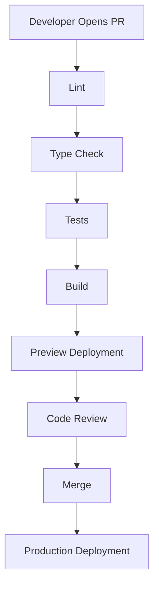

CI/CD is the most immediately applicable infrastructure skill on this list.
Almost every frontend team has a pipeline, almost every frontend engineer edits
it eventually, and a slow or flaky one taxes every change the team makes.

A typical frontend pipeline:



**CI** is everything up to the merge: prove the change is safe. **CD** is
everything after: get it to users without drama.

## A starting workflow

```yaml
name: CI

on:
  pull_request:
  push:
    branches: [main]

jobs:
  build:
    runs-on: ubuntu-latest

    steps:
      - uses: actions/checkout@v4

      - uses: actions/setup-node@v4
        with:
          node-version: 22
          cache: npm

      - run: npm ci

      - run: npm run lint

      - run: npm run typecheck

      - run: npm run build
```

Two details worth copying. `cache: npm` caches the dependency download between
runs, usually the single largest saving available. And `npm ci` rather than
`npm install` — it installs exactly what the lockfile says and fails if the
lockfile is out of date, which is what you want in CI and not what `install`
does.

## The vocabulary

```text
workflow   one YAML file, triggered by events
job        runs on its own fresh machine; jobs are parallel by default
step       one command or action inside a job
runner     the machine executing a job
artifact   files passed between jobs or kept after the run
```

The important consequence: **jobs do not share a filesystem.** A build in one
job is invisible to a deploy in another unless you upload it as an artifact.
Steps within a job do share one, which is why related work usually belongs in
the same job.

## Make it fast, or it will be ignored

A pipeline people wait ten minutes for is a pipeline people work around.

**Parallelize independent checks.** Lint, typecheck and tests have no dependency
on each other. Separate jobs run simultaneously, turning a sum into a maximum.

```yaml
jobs:
  lint:
    runs-on: ubuntu-latest
    steps: [...]

  typecheck:
    runs-on: ubuntu-latest
    steps: [...]

  test:
    runs-on: ubuntu-latest
    steps: [...]
```

**Cancel superseded runs.** Without this, three pushes in five minutes means
three full pipelines, two of which nobody will read:

```yaml
concurrency:
  group: ${{ github.workflow }}-${{ github.ref }}
  cancel-in-progress: true
```

**Cache the build too.** Next.js, Turbo, Nx and Vite all support incremental
builds if you persist their cache directories between runs.

**Only run what changed.** In a monorepo, a docs-only change does not need the
full application test suite. Path filters and tooling like Turborepo's affected
detection handle this.

## Deployment strategies

How the new version replaces the old:

**Rolling** — replace instances a few at a time. No downtime, but both versions
serve traffic during the rollout, so they must be mutually compatible.

**Blue-green** — run the new version alongside the old, then switch all traffic
at once. Instant rollback by switching back. Costs double capacity during the
deploy.

**Canary** — send a small percentage of traffic to the new version, watch error
rates, then widen. The safest option for risky changes and the most
infrastructure to set up.

Static frontends get the easiest version of this: an
[immutable deployment](/frontend-infrastructure/deployment) with an alias
switch, which is blue-green with no extra machinery.

## Secrets in the pipeline

Never commit credentials. Store them as repository or environment secrets and
reference them:

```yaml
- run: npm run deploy
  env:
    DEPLOY_TOKEN: ${{ secrets.DEPLOY_TOKEN }}
```

Better still, avoid long-lived secrets entirely. GitHub Actions can exchange its
OIDC identity for temporary cloud credentials, so no static key exists to leak
— see [IAM](/frontend-infrastructure/iam).

<Callout>
Secrets are masked in logs, but masking is pattern matching on the exact value.
A secret that gets base64-encoded, JSON-escaped or split across lines will print
in the clear. Do not echo them, even while debugging.
</Callout>

## Branch protection

The pipeline only protects you if it is enforced. Require passing checks and a
review before merge, otherwise CI becomes advisory — and a red build that
merged anyway is how `main` ends up broken on a Friday.
