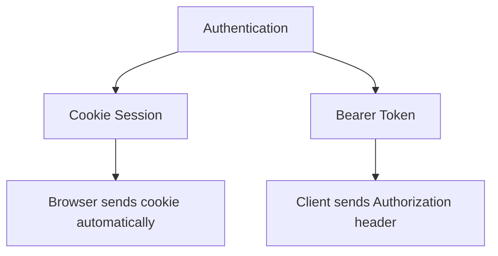

Where you put the credential determines which attacks you are exposed to. This
is a frontend architecture decision with security consequences, which is why it
deserves its own page.



The difference is automatic versus manual. Cookies are attached by the browser
to every matching request without your code's involvement. Bearer tokens are
attached by your code, deliberately, per request.

Both of those properties cut both ways.

## The cookie attributes

Four flags decide whether a session cookie is safe:

```http
Set-Cookie: session=abc123; HttpOnly; Secure; SameSite=Lax; Path=/
```

**`HttpOnly`** — JavaScript cannot read it. This is the one that matters most:
it means an XSS cannot steal the session, only act within the current page.

**`Secure`** — only sent over HTTPS, so it cannot leak over a plain connection.

**`SameSite`** — whether the cookie rides along on cross-site requests. `Lax` is
the modern default and blocks most CSRF while still allowing top-level
navigation from external links. `Strict` is safer and breaks inbound links from
email. `None` permits cross-site sending and *requires* `Secure`.

**`Path` / `Domain`** — scope. Setting `Domain=.example.com` shares the cookie
with every subdomain, including any one of them that gets compromised.

## XSS and CSRF

The two attacks, and why the choice is a trade rather than a winner.

**XSS** — attacker JavaScript runs on your page. It can read anything your code
can read. `localStorage` is fully exposed; an `HttpOnly` cookie is not.

**CSRF** — another site causes the user's browser to make an authenticated
request to yours. This only works because cookies are sent automatically, so it
affects cookies and not bearer tokens.

```text
localStorage token  →  vulnerable to XSS, immune to CSRF
HttpOnly cookie     →  immune to XSS theft, needs CSRF protection
```

The asymmetry that decides it: CSRF has a complete, standard mitigation
(`SameSite` plus a CSRF token). XSS token theft does not — if an attacker is
running JavaScript on your origin, they can read the token, full stop.

**So prefer `HttpOnly` cookies for browser sessions.** Bearer tokens make sense
for native apps, server-to-server calls, and third-party API clients, where
there is no cookie jar and no CSRF surface.

Note that XSS is still bad with cookies. The attacker cannot steal the session,
but they can make authenticated requests from the page. It bounds the damage
rather than eliminating it.

## CSRF protection

With `SameSite=Lax` you are protected against the common cases. For state-changing
requests, add a token:

```text
1. Server issues a random CSRF token, readable by JS
2. Client sends it in a header on POST/PUT/DELETE
3. Server compares it against the session
```

The attacker's site can cause a request to be sent, but cannot read your token
to include it — the same-origin policy prevents that.

## Cross-origin cookies

The setup that catches people out. Frontend on `app.example.com`, API on
`api.example.com`:

```js
fetch("https://api.example.com/me", { credentials: "include" })
```

All of the following must hold:

- `credentials: "include"` on the request
- `SameSite=None; Secure` on the cookie
- `Access-Control-Allow-Credentials: true` on the response
- `Access-Control-Allow-Origin` set to the exact origin, not `*`

That last one is a hard rule in the spec: wildcards and credentials are mutually
exclusive.

It is a lot of moving parts, which is the argument for putting both behind one
origin with a [reverse proxy](/frontend-infrastructure/reverse-proxies) and
avoiding the problem entirely.

<Callout>
Third-party cookie restrictions keep tightening across browsers. Architectures
that depend on cookies crossing site boundaries are on a shrinking foundation —
same-origin or same-site is the durable choice.
</Callout>

## Summary

| | Cookie (`HttpOnly`) | Bearer token |
| --- | --- | --- |
| Sent | Automatically | Manually |
| Readable by JS | No | Yes |
| XSS theft | Protected | Exposed |
| CSRF | Needs mitigation | Not applicable |
| Cross-origin | Configuration heavy | Straightforward |
| Best for | Browser sessions | Native apps, APIs |
