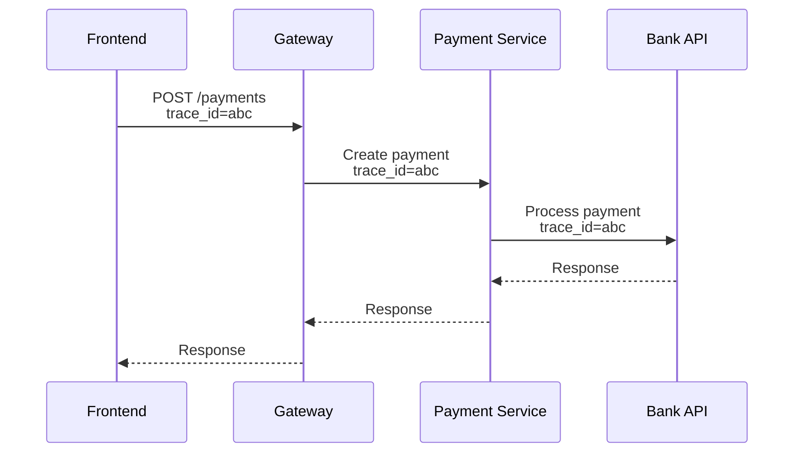

Logs tell you what happened in one service. When a request crosses five, you
need something that follows it across all of them.

Imagine the user presses **Pay**:



One ID, propagated through every hop. Now "the payment was slow" has an answer
with a number attached: the gateway took 8ms, the payment service 40ms, and the
bank API 3 seconds. The investigation is over before it started.

## Traces and spans

```text
Trace   the whole journey of one request
Span    one unit of work within it
Context the IDs passed between services to link them
```

Spans nest. A trace is a tree, and the shape of the tree is itself
informative — sequential spans that could have been parallel are visible
immediately, as is the classic N+1 query showing up as fifty identical spans in
a row.

Propagation happens through a standard header:

```http
traceparent: 00-4bf92f3577b34da6a3ce929d0e0e4736-00f067aa0ba902b7-01
```

Any service that reads it and passes it along joins the trace. Any service that
drops it breaks the chain, and the trace ends there — which is the usual reason
a trace looks mysteriously short.

## Correlation IDs

If full tracing is too much to adopt at once, start here. Generate an ID at the
edge, attach it to every log line, and return it to the client:

```http
X-Request-Id: req_a1b2c3
```

Surface it in your error UI. A support ticket that says "error reference
req_a1b2c3" turns a vague report into a one-query investigation. This is the
cheapest observability win available and requires no new vendor.

## Frontend observability

Everything above stops at the server. But most of what users experience happens
after the response — parsing, rendering, hydration, interaction.

What to capture in the browser:

**JavaScript errors**, including unhandled promise rejections, which are easy to
miss and where most async bugs surface.

**Failed API calls** — status, endpoint, duration. Note that the browser sees
failures the server never records: timeouts, offline, DNS failures, requests
blocked by an extension or corporate proxy.

**Web Vitals** — LCP, INP and CLS, collected from real users rather than a lab
tool. Field data and Lighthouse scores routinely disagree, and the field data is
the one that reflects reality.

**Resource timing** — which assets are slow, and from which regions.

## Connecting the two halves

The valuable move is joining browser and server telemetry into one trace. When
the frontend sends a `traceparent` on its API calls, a slow interaction can be
attributed precisely:

```text
LCP 4.2s
  ├── document request      2.9s   ← server-side trace continues here
  │     └── database query  2.7s   ← found it
  └── render                0.4s
```

Without that link you have two disconnected stories and an argument about
whether it is a frontend or backend problem. With it, the trace answers the
question.

<Callout>
Collect Web Vitals with the `web-vitals` library rather than reading the
Performance API directly. The metric definitions change as the standards evolve
— INP replaced FID in 2024 — and the library tracks those changes for you.
</Callout>

## Sensible defaults

```text
Errors          Sentry, source maps uploaded at build time
Web Vitals      web-vitals library → your analytics endpoint
Tracing         OpenTelemetry, browser and server
Correlation     request ID in every log, returned to the client
```

Start with errors and a correlation ID. Those two cover most incidents. Add
tracing when you have enough services that "which one is slow" is a real
question.
