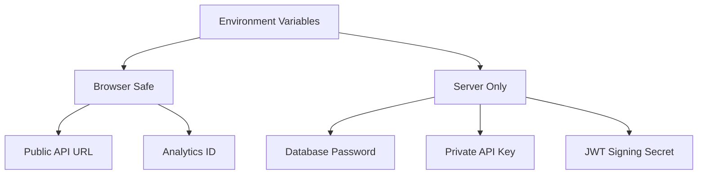

This page exists because the mistake it describes is common, easy to make, and
occasionally catastrophic.

Environment variables are not secret by virtue of being environment variables.
In a frontend build they are frequently the opposite: inlined into JavaScript
that anyone can read with view-source.

## The rule

**Anything bundled into client JavaScript is public.** Permanently, to everyone,
including in old deploys that are still cached somewhere.

Frameworks mark the boundary with a prefix:

```dotenv
NEXT_PUBLIC_API_URL=https://api.example.com   # sent to the browser
VITE_API_URL=https://api.example.com          # sent to the browser
DATABASE_URL=postgres://...                   # server only
```

The prefix is not a security feature — it is a declaration. It says "I
understand this will be visible to users." Variables without it are simply never
inlined.

## Two groups



Sort every variable into one of these before adding it. The question is not "is
this sensitive?" but "am I willing to print this on the homepage?"

Never write something like:

```dotenv
NEXT_PUBLIC_DATABASE_PASSWORD=...
```

unless your career goal is to author an incident report. The prefix does not
protect it; the prefix is what _exposes_ it.

## Publishable vs secret keys

Many third-party services issue two keys, and the naming is a useful signal:

```text
pk_live_...   publishable — designed for client-side use
sk_live_...   secret     — server only, full account access
```

Stripe's publishable key is meant to be in your bundle; it can only create
payment intents. The secret key can issue refunds. Services that offer this
split have already done the thinking for you — use the right one rather than
the one that made the code shorter.

Supabase's `anon` key is the same idea, with an important caveat: it is safe
_only_ if row-level security is configured. The key assumes a policy layer
exists behind it.

## Build time vs runtime

The distinction that causes the most confusion in containerized frontends.

Client-side variables are inlined during `npm run build`. They are baked into
the output. Changing the environment at runtime does nothing, because there is
no variable left to change — just a string literal in a bundle.

```text
Server-side vars   read at runtime      → one image, many environments
Client-side vars   fixed at build time  → one image per environment
```

This breaks "build once, deploy everywhere" for anything client-side. Options:

- **Build per environment.** Simple, but staging and production run different
  artifacts, so you never tested exactly what you shipped.
- **Fetch public config at runtime.** A `/config` endpoint or a small inline
  script in the document. One artifact everywhere, at the cost of one request or
  a slightly less cacheable document.

The second is better at scale. The first is fine for most teams.

## Where secrets should live

```text
.env.local        local development only; gitignored
GitHub Secrets    CI/CD
Secrets Manager   production (AWS/GCP secret stores, Vault)
Platform env vars Vercel/Netlify project settings
```

Commit a `.env.example` with every key and no values, so a new developer knows
what to set without anyone pasting real credentials into chat.

<Callout>
  If a secret is committed, rotating it is the fix — not deleting the commit. It
  is in the reflog, in every clone, in forks, and quite possibly already
  scraped. Treat any secret that ever touched a repository as compromised.
</Callout>

## Checking what you shipped

A worthwhile habit after any change to environment handling. Search the built
output for something that should not be there:

```bash
npm run build
grep -r "sk_live" .next/ dist/ 2>/dev/null && echo "LEAK" || echo "clean"
```

Worth adding to CI as a guard against the specific mistake of someone adding a
`NEXT_PUBLIC_` prefix to make an error go away.
