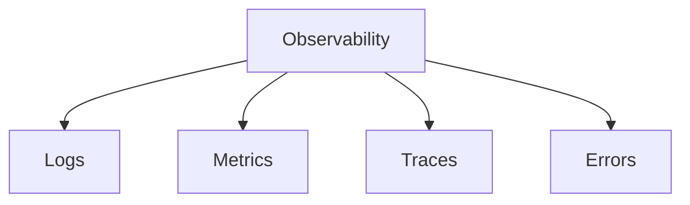

Production debugging should not depend on:

```js
console.log("here");
```

Observability is the property of a system that lets you answer questions about
its behaviour without shipping new code to ask them. The distinction from
monitoring is useful: monitoring tells you *that* something is wrong,
observability lets you work out *why*.

Four signals, each answering a different question:



```text
Logs      what happened, in detail, for one event
Metrics   how much and how often, aggregated over time
Traces    where the time went, across services
Errors    what broke, grouped, with the context to reproduce it
```

## Structured logs

The single highest-value change most teams can make. Log objects, not sentences:

```json
{
  "level": "error",
  "requestId": "req_123",
  "userId": "usr_42",
  "route": "/checkout",
  "message": "Payment failed"
}
```

That can be filtered, counted and grouped. This cannot:

```text
payment fail bro
```

Once logs are structured, questions like "how many checkout failures for this
user in the last hour" become a query instead of an archaeology project.

Include a **request ID** on every line. It is what lets you reconstruct a single
user's journey from interleaved logs of thousands of concurrent requests.

Never log credentials, tokens, full card numbers or personal data. Logs are
widely readable, retained for a long time, and shipped to third parties — they
are the most common accidental data leak in a stack.

## Metrics and what to alert on

Metrics are cheap to store and aggregate, so they cover "how is the system
behaving" over time. The classic starting set:

```text
Rate       requests per second
Errors     percentage failing
Duration   latency distribution
Saturation how close to a limit
```

Track latency as **percentiles**, never averages. An average hides the problem:
if p50 is 100ms and p99 is 8 seconds, one in a hundred requests is unusable and
the average still looks healthy.

Alert on symptoms users feel — error rate, latency — rather than causes like CPU
usage. High CPU with a fast, correct site is not an incident. Every alert should
be actionable; alerts that fire regularly and get ignored train people to ignore
the real ones.

## Errors

Error tracking deserves its own tool because it does something logs do not:
deduplication. Ten thousand occurrences of one bug become a single grouped issue
with a count, a first-seen timestamp and the affected release.

What makes an error report actionable:

```text
Stack trace with source maps    readable frames, not minified soup
Release version                 which deploy introduced it
Breadcrumbs                     what the user did first
User context                    how many people, which segment
Browser / OS                    is it one engine only
```

**Upload your source maps.** A minified stack trace is close to useless, and
this is the most common reason error tracking fails to pay off. Upload them to
the error service at build time and do not serve them publicly.

## Sampling

Full-fidelity telemetry for every request is expensive. Sampling keeps the cost
proportionate:

```text
Errors        100% — always keep
Traces        1–10% of normal traffic
Slow requests keep disproportionately
Debug logs    off in production, enabled on demand
```

Tail-based sampling is the better strategy where available: decide *after* the
request completes, so you keep every trace that errored or was slow, and a small
sample of the boring ones.

## Tooling

```text
Sentry          errors, frontend and backend
OpenTelemetry   vendor-neutral instrumentation standard
Datadog         metrics, logs, traces, one platform
Grafana         dashboards over Prometheus/Loki/Tempo
CloudWatch      AWS-native logs and metrics
```

Prefer instrumenting with **OpenTelemetry** where you can. It is the vendor-
neutral standard, so changing backend later is a configuration change rather
than re-instrumenting the application.
