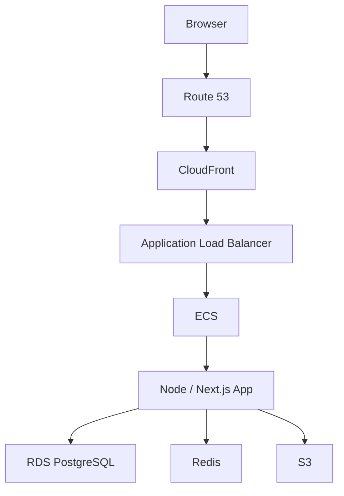

After the fundamentals, pick one cloud provider and learn it properly. AWS is a
reasonable default because it is the most widely used and its vocabulary shows
up in job descriptions, but the concepts transfer.

You do not need to learn every service. AWS has hundreds; a competent frontend
engineer needs about ten, and each one maps to something from the earlier
chapters.

| Service | Purpose | Covered in |
| --- | --- | --- |
| Route 53 | DNS | [DNS](/frontend-infrastructure/dns) |
| CloudFront | CDN | [CDN](/frontend-infrastructure/cdn) |
| S3 | Object storage | [Object storage](/frontend-infrastructure/object-storage) |
| ALB | Load balancer | [Load balancers](/frontend-infrastructure/load-balancers) |
| ECS | Container hosting | [Docker](/frontend-infrastructure/docker) |
| ECR | Docker image registry | [Docker](/frontend-infrastructure/docker) |
| RDS | Relational database | — |
| ElastiCache | Redis | [Caching](/frontend-infrastructure/caching) |
| IAM | Permissions | [IAM](/frontend-infrastructure/iam) |
| CloudWatch | Logs and metrics | [Observability](/frontend-infrastructure/observability) |

That column on the right is the point of this chapter. Cloud services are
implementations of concepts you have already learned, with proprietary names.

## A worked architecture

Putting them together for a typical containerized application:



Read it as the request path from the first chapter, with product names
substituted. DNS resolves, the CDN serves what it can, the load balancer picks
an instance, the container runs your app, and the app talks to its data stores.

Understanding this diagram is worth considerably more than memorizing
certification questions.

## Regions and availability zones

Two concepts that affect latency and cost more than people expect.

A **region** is a geographic location (`ap-southeast-1` is Singapore). An
**availability zone** is an isolated datacenter within it. Spreading across AZs
survives a datacenter failure and is nearly free; spreading across regions
survives a regional outage and is a significant engineering project.

Pick the region closest to your users and keep your database in one region. The
[CDN](/frontend-infrastructure/cdn) handles global latency for content; your
data does not need to be everywhere, and distributed databases are a much harder
problem than they look.

## The cost model

Cloud billing has a shape worth knowing before it surprises you:

```text
Compute      per second of running instance
Storage      per GB-month
Requests     per million
Data out     per GB — expensive
Data in      usually free
```

**Egress is the one that bites.** Data leaving the cloud costs roughly ten times
what storing it does, which is exactly what a media-heavy frontend does all day.
Serving assets through CloudFront rather than directly from S3 is cheaper as
well as faster, because CDN egress is priced lower and cache hits never touch
the origin.

Cross-AZ traffic is also billed. A chatty application spread across zones can
generate a surprising internal transfer bill.

<Callout>
Set a billing alarm on day one, before deploying anything. The standard cloud
learning experience involves leaving something running over a weekend and
receiving an unwelcome invoice.
</Callout>

## Serverless as an alternative

The other model: no instances to manage, pay per invocation, scales to zero.

```text
Lambda          run a function per request
API Gateway     HTTP in front of it
DynamoDB        managed NoSQL
```

Good for spiky or low traffic, and for glue between services. The trade-offs are
real: cold starts add latency, execution time is capped, and traditional
connection pooling does not work well because each concurrent invocation is its
own environment.

Most frontend deployment platforms are serverless underneath. A Next.js route
handler on Vercel is a function invocation, which is why the same constraints
show up there.

## Do not over-build

The most common infrastructure mistake is building for a scale that never
arrives. A single container behind a load balancer, one managed database and a
CDN will serve a very large number of real products.

Multi-region, Kubernetes and event-driven microservices are answers to problems
you should be able to point at before adopting them. Start with the simple
architecture above and let actual load tell you what to change.
