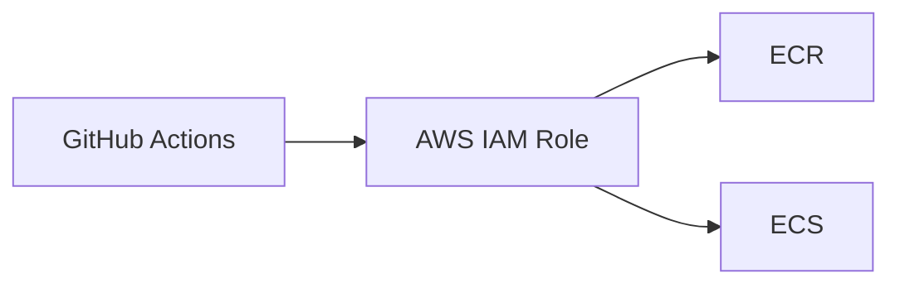

First, disambiguate the term. AWS IAM is not the same thing as the "IAM service"
that authenticates your users, even though both are called IAM.

```text
Application IAM   who your users are, what they may do in your product
Cloud IAM         who may access which cloud resources
```

This page is the second one. Cloud IAM controls:

```text
who can access which AWS resources
```

## The pieces

**Principal** — the actor. A user, or more usefully a role.

**Policy** — a document granting or denying specific actions on specific
resources.

**Role** — a set of permissions that can be *assumed* temporarily. This is the
mechanism you should reach for, because assuming a role produces short-lived
credentials that expire on their own.

A policy in its typical shape:

```json
{
  "Effect": "Allow",
  "Action": ["s3:PutObject", "s3:GetObject"],
  "Resource": "arn:aws:s3:::uploads/*"
}
```

Note the specificity of `Resource`. `"Resource": "*"` grants the action on
everything in the account, which is how a narrowly-intended permission becomes a
broad one.

## Least privilege

The principle worth internalizing:

> Grant only the permissions actually needed, on only the resources they are
> needed for.

The failure mode is universal and understandable: something returns
`AccessDenied`, the deadline is today, and `s3:*` on `*` makes it work. It then
stays that way forever, and a compromised deployment token now has full access
to every bucket in the account.

The right loop is to start with nothing, add the specific action that failed,
and repeat. Slower once, safer permanently.

## Deployment pipelines

The place a frontend engineer meets IAM most directly.



A deploy pipeline needs to push an image and update a service. That is all it
needs:

```text
ecr:GetAuthorizationToken
ecr:PutImage
ecs:UpdateService
ecs:DescribeServices
```

It does not need to read your database, delete buckets or create users. If the
pipeline's credentials leak — and CI credentials leak more often than any other
kind, through logs, forks and compromised actions — the blast radius is bounded
by exactly this list.

## Stop using long-lived keys

The better pattern, and one worth adopting the next time you touch a workflow.

GitHub Actions can authenticate to AWS via OIDC: the workflow presents a signed
identity token, AWS verifies it against a trust policy, and issues credentials
valid for the length of the job. No stored access key exists.

```yaml
permissions:
  id-token: write
  contents: read

steps:
  - uses: aws-actions/configure-aws-credentials@v4
    with:
      role-to-assume: arn:aws:iam::123456789:role/github-deploy
      aws-region: ap-southeast-1
```

Nothing to rotate, nothing to leak, and access can be scoped in the trust policy
to a specific repository and branch — so a fork or a feature branch cannot
assume the production role.

<Callout>
Scope the trust policy's `sub` condition carefully. A policy that trusts
`repo:org/*` lets any repository in the organization deploy to production.
Pin it to the repository and, for production roles, the branch or environment.
</Callout>

## Practical habits

**Never use the root account.** Enable MFA on it, then leave it alone.

**Roles over users.** Humans assume roles via SSO; services assume roles via
their runtime. Long-lived access keys are a last resort.

**Read the access analyzer.** Cloud providers will tell you which granted
permissions have never been used. It is the fastest route from an over-broad
policy to a correct one.

**Separate environments by account.** The most reliable way to guarantee a
staging mistake cannot touch production data is for staging to have no
credentials that reach it.
