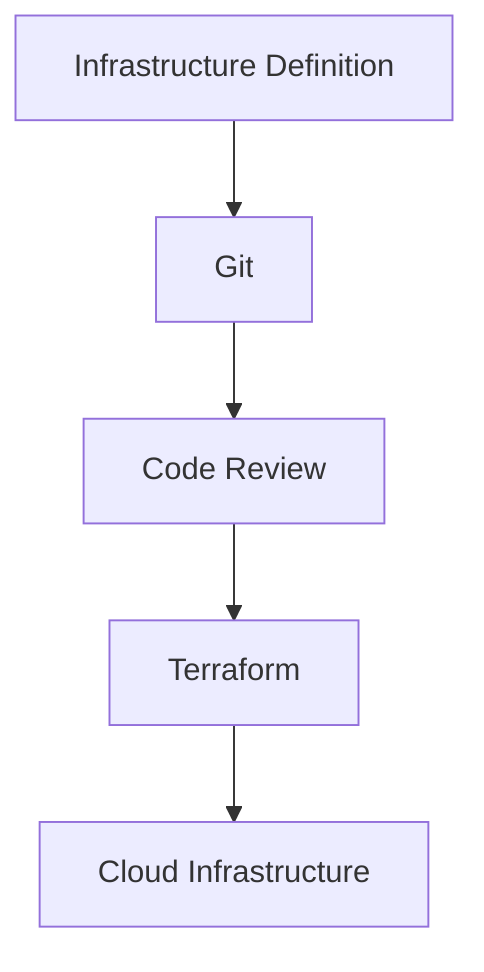

Learn this *after* you have built infrastructure by hand. Terraform is a way of
expressing infrastructure you already understand; learning both at once means
debugging your mental model and your HCL simultaneously.

The problem it solves is that clicking through a dashboard —

```text
Create bucket
Create CDN
Create DNS record
Create load balancer
```

— leaves no record of what you did or why. Six months later nobody knows which
settings were deliberate, staging has quietly drifted from production, and
rebuilding after an incident means remembering a sequence nobody wrote down.

## Declaring instead of doing

```hcl
resource "aws_s3_bucket" "frontend" {
  bucket = "example-frontend"
}
```

You describe the desired end state. Terraform compares it to reality and works
out the steps to close the gap. Running it twice changes nothing the second
time — that property is called idempotence, and it is what makes the tool safe
to run repeatedly.

## Why this is worth the effort



Infrastructure changes go through the same workflow as code changes: a diff, a
review, a history. "Why does the CDN cache HTML for 60 seconds?" is answered by
`git blame` and a pull request discussion, not by guesswork.

The rest follows from that: environments are reproducible, disaster recovery is
a rerun rather than an archaeology exercise, and nobody can change production by
clicking something at 11pm without a trace.

## The vocabulary

```text
providers   which cloud or service this manages
resources   the things being created
variables   inputs that differ per environment
outputs     values exported for other configs or humans
state       Terraform's record of what it created
modules     reusable groups of resources
```

The workflow:

```bash
terraform init     # download providers, configure backend
terraform plan     # show what would change — read this
terraform apply    # make it so
terraform destroy  # tear it all down
```

`plan` is the one to build a habit around. It prints exactly what will be
created, changed or destroyed. Reading it carefully — especially for anything
marked *destroy* or *replace* — is what stops an innocuous-looking edit from
recreating your database.

## State is the thing to be careful with

Terraform records what it created in a state file, and that file is the source
of truth for the mapping between your configuration and real resources.

Two rules follow. **Store it remotely** (S3 with locking, or Terraform Cloud),
never in Git — it is shared mutable state, and it frequently contains secrets in
plain text. **Never edit it by hand.** If state and reality diverge, use
`terraform import` or `terraform state` commands.

Locking matters as soon as more than one person or pipeline can run `apply`. Two
concurrent applies against one state file corrupt it.

## Drift

Drift is when reality stops matching the configuration — usually because someone
changed something in the console during an incident.

Terraform will try to revert it on the next apply, which can be a surprise if
the manual change was load-bearing. The cultural fix is stronger than the
technical one: once infrastructure is in code, the console becomes read-only.
Emergency changes are fine, but they get backported to the configuration the
same day.

<Callout>
Do not put everything in one Terraform configuration. Separate slow-changing
foundations (network, DNS, databases) from fast-changing application resources.
A ten-minute plan for a routine deploy means nobody runs it, and a single
blast radius means a typo can take out the network.
</Callout>

## Alternatives

Terraform is the most widely used, but not the only option:

```text
Terraform / OpenTofu   HCL, multi-cloud, the default choice
Pulumi                 real languages — TypeScript, Python
AWS CDK                TypeScript that compiles to CloudFormation
SST                    application-oriented, good for frontend stacks
```

Pulumi and CDK are appealing if you would rather write TypeScript than learn
HCL. The trade is that a general-purpose language makes it easy to write
infrastructure that is clever, and clever infrastructure is difficult to review
in a diff.
