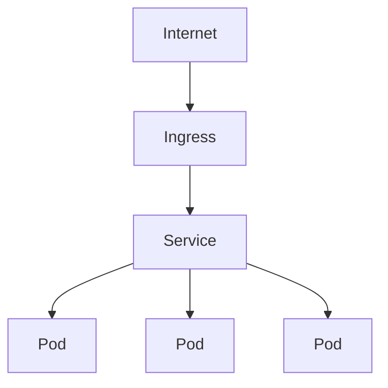

Do not begin an infrastructure journey here. Kubernetes assumes every layer
below it and hides all of them, so starting at the top means debugging a
networking problem through four abstractions you have not met yet.

Understand these first:

```text
HTTP · DNS · TLS · Linux
Nginx · Docker · CI/CD
Load Balancers · Cloud Infrastructure
```

With those in place, Kubernetes becomes recognizable rather than mysterious:
most of it is a declarative wrapper around things you already know.

## What it actually does

Kubernetes is a control loop. You declare the desired state — "five copies of
this image, reachable at this hostname" — and it continuously works to make
reality match: restarting crashed containers, replacing failed nodes, rolling
out new versions gradually.

That is genuinely valuable at a certain scale, and mostly overhead below it.

## The request path

The one diagram worth memorizing, because it maps directly onto earlier
chapters:



**Ingress** is a [reverse proxy](/frontend-infrastructure/reverse-proxies) —
usually literally Nginx — handling TLS and routing by host and path.

**Service** is a [load balancer](/frontend-infrastructure/load-balancers) with a
stable DNS name, in front of a set of pods that come and go.

**Pod** is one or more [containers](/frontend-infrastructure/docker) scheduled
together, sharing a network namespace.

Three concepts you already know, with new names.

## The objects

```text
Cluster      the whole thing
Node         a machine in it
Pod          the smallest deployable unit
Deployment   declares how many pod replicas to keep running
Service      stable networking in front of pods
Ingress      external HTTP routing and TLS
ConfigMap    non-secret configuration
Secret       sensitive configuration
Namespace    logical separation within a cluster
```

Almost nothing creates pods directly. You declare a Deployment, it manages a
ReplicaSet, and that maintains the pods. When you scale or roll out, you are
editing the Deployment and letting the controller act.

A minimal deployment:

```yaml
apiVersion: apps/v1
kind: Deployment
metadata:
  name: frontend
spec:
  replicas: 3
  selector:
    matchLabels:
      app: frontend
  template:
    metadata:
      labels:
        app: frontend
    spec:
      containers:
        - name: frontend
          image: registry.example.com/frontend:abc123
          ports:
            - containerPort: 3000
```

Note the image tag is a specific version, not `latest`. Mutable tags make
rollouts non-deterministic and rollbacks meaningless — the same problem as
[unhashed assets](/frontend-infrastructure/caching), one layer down.

## What a frontend engineer actually needs

Realistically, unless you are on a platform team:

**Read a manifest** and understand what it deploys.

**Set resource requests and limits.** A Node process without limits can consume
a node; with limits set too low it gets OOM-killed mid-request.

**Write health probes.** `readinessProbe` decides when a pod starts receiving
traffic, `livenessProbe` decides when to restart it. A readiness probe that
returns healthy before the app can serve means traffic hits a pod that is not
ready — the Kubernetes version of the health check problem from
[Load Balancers](/frontend-infrastructure/load-balancers).

**Debug a pod.** These four commands cover most incidents:

```bash
kubectl get pods
kubectl describe pod <name>
kubectl logs <name> --previous
kubectl exec -it <name> -- sh
```

`describe` explains why a pod is pending or crash-looping. `logs --previous`
shows the output of the container that just died, which is where the actual
error is.

<Callout>
`Secret` objects are base64-encoded, not encrypted. Anyone who can read secrets
in a namespace can read the values. Real secret management needs an external
store — Vault, a cloud secrets manager, or the Secrets Store CSI driver.
</Callout>

## Do you need it?

Usually not. Kubernetes earns its complexity when you have many services, many
teams, multi-cloud or on-premise requirements, or genuinely need fine-grained
orchestration.

For one frontend and an API, a managed container service like ECS, Cloud Run or
Fly.io does the same job with a fraction of the operational surface. Choosing
that is not a lesser choice — it is the same trade discussed in
[Deployment](/frontend-infrastructure/deployment), made deliberately.

The reason to understand Kubernetes anyway is that you will join teams that use
it, and reading a manifest is a reasonable expectation. Operating a cluster is
someone else's full-time job.
