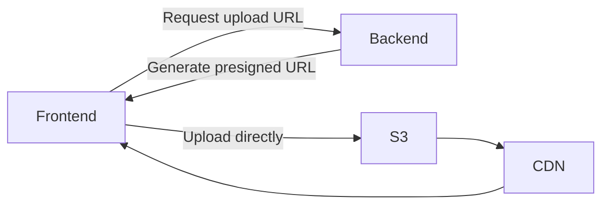

Frontend applications handle files constantly:

```text
images · videos · avatars · PDFs · documents · static assets
```

Object storage (S3, R2, GCS, Blob Storage) is where they belong. It is not a
filesystem — there are no real directories, and you cannot append to or edit
part of an object. You store, retrieve and delete whole objects by key.

That constraint buys effectively unlimited capacity, high durability and very
low cost, with the storage decoupled from any server. It also pairs naturally
with the
[statelessness requirement](/frontend-infrastructure/load-balancers) from
horizontal scaling: files written to a container's disk vanish when it is
replaced, and are invisible to other instances in the meantime.

## Presigned uploads

The important pattern on this page. The naive approach routes uploads through
your API:

```text
Browser
 ↓
Backend     ← the whole file passes through here
 ↓
S3
```

This makes your API server a bottleneck for something it adds no value to. It
consumes memory and request time proportional to file size, hits request body
limits, and times out on slow connections. A 500MB video upload can occupy a
server process for minutes.

Instead, have the backend authorize the upload and let the browser do it
directly:



```text
Browser
 ↓
S3
```

A presigned URL is a normal URL with a signature and expiry embedded. Anyone
holding it can perform exactly one operation, on one key, for a limited time —
without credentials.

```js
// Server: authorize, then sign
const url = await getSignedUrl(
  s3,
  new PutObjectCommand({
    Bucket: "uploads",
    Key: `users/${userId}/${fileId}`,
    ContentType: contentType,
  }),
  { expiresIn: 300 },
);

// Browser: upload straight to storage
await fetch(url, { method: "PUT", body: file });
```

Your server sees a small JSON request, never the bytes. The upload scales with
the storage service rather than your compute.

## What the backend must still check

The presigned URL is where authorization happens, so do it properly *before*
signing:

- Is this user allowed to upload at all?
- Is the key inside the namespace they own? Never accept a client-supplied path
  unfiltered — `../` and absolute keys are how one user overwrites another's
  files.
- Is the declared content type allowed?
- Enforce a maximum size in the signed policy, not just in the UI.

And verify after the fact. A client that declares `image/png` can upload
anything; check the actual content server-side before serving it back or marking
it usable.

## Serving files back

Put a [CDN](/frontend-infrastructure/cdn) in front of the bucket. It is faster
for users and cheaper for you, since CDN egress is priced below direct storage
egress and cache hits never reach the bucket.

For private files, presign the download too — a short-lived GET URL, generated
per request after an authorization check. Avoid the tempting shortcut of a
public bucket with unguessable filenames: that is not access control, and
publicly readable buckets remain one of the most common sources of data
exposure.

<Callout>
Buckets should be private by default. If you find yourself making one public to
fix a 403, the correct fix is almost always a CDN with origin access
configured, or a presigned URL.
</Callout>

## Direct upload gotchas

Three things that catch people out:

**CORS on the bucket.** The browser is now making a cross-origin PUT to the
storage service, so the bucket needs its own CORS configuration allowing your
origin and the `PUT` method. This is the first error you will hit.

**No progress without XHR or streams.** `fetch` does not report upload progress;
`XMLHttpRequest` does, which is why upload components still use it.

**Large files need multipart.** Above ~100MB, split into parts, each with its
own presigned URL. This enables retrying one failed chunk instead of the whole
transfer, and parallel uploads.
