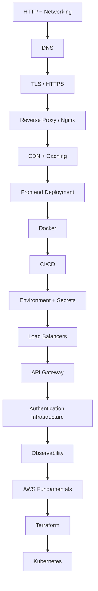

The order matters more than the list. Each phase makes the next one
comprehensible, and skipping ahead is why infrastructure so often feels like
memorizing disconnected facts.



Grouped into phases, each with a goal specific enough to know when you have met
it.

## Phase 1 — Internet fundamentals

```text
HTTP · DNS · TLS · CORS · cookies · browser networking
```

> **Goal:** explain what happens between typing a URL and seeing a page.

The test: can you describe every step, and name which one you would check first
for a given symptom? See
[The Big Picture](/frontend-infrastructure/the-big-picture).

## Phase 2 — Frontend delivery

```text
CDN · caching · Vercel · Cloudflare · static deployment · SSR · edge rendering
```

> **Goal:** understand how frontend code reaches users.

The test: explain why a user still sees the old JavaScript after a deploy, and
give three possible causes at different layers.

## Phase 3 — Server infrastructure

```text
Linux · Nginx · Docker · load balancing · API gateways
```

> **Goal:** host a frontend without a platform doing it for you.

The test: a VPS, a domain, and a working HTTPS site — with certificates, proxy
rules and cache headers you configured yourself.

## Phase 4 — Automation

```text
GitHub Actions · CI/CD · Docker registry · deployment strategies
```

> **Goal:** push code and have it deploy safely without manual steps.

The test: a pipeline that builds, tests, deploys, and that you can roll back
from in under a minute.

## Phase 5 — Cloud

```text
Route 53 · CloudFront · S3 · ALB · ECS · ECR · RDS · Redis · IAM · CloudWatch
```

> **Goal:** understand how production systems are assembled.

The test: draw your application's architecture and name what each component
does, what it costs, and what happens when it fails.

## Phase 6 — Production engineering

```text
logs · metrics · traces · Sentry · OpenTelemetry · security · scaling
```

> **Goal:** know what is happening when production breaks.

The test: a user reports a slow checkout. Can you find out where the time went
without adding code and redeploying?

## Phase 7 — Infrastructure as code

```text
Terraform
```

> **Goal:** recreate your infrastructure without clicking through a dashboard.

The test: destroy a staging environment and bring it back with one command.

## Phase 8 — Kubernetes

Only now:

```text
Pods · Deployments · Services · Ingress · ConfigMaps · Secrets · Autoscaling
```

> **Goal:** understand container orchestration, rather than memorizing YAML.

The test: read an unfamiliar manifest and say what it deploys and how traffic
reaches it.

<Callout>
This is not a curriculum to complete before doing real work. Phases 1–4 cover
the large majority of what frontend engineers actually hit; 5–8 are worth
understanding conceptually and learning properly only when a job requires them.
</Callout>

## Pacing

Do not try to do this in order, exclusively, for months. The effective pattern
is to learn a phase when a real problem makes it relevant — a custom domain
teaches DNS, a slow site teaches caching, a Docker-based project teaches
containers.

The [practice project](/frontend-infrastructure/practice-project) is the
alternative when no such problem presents itself.
