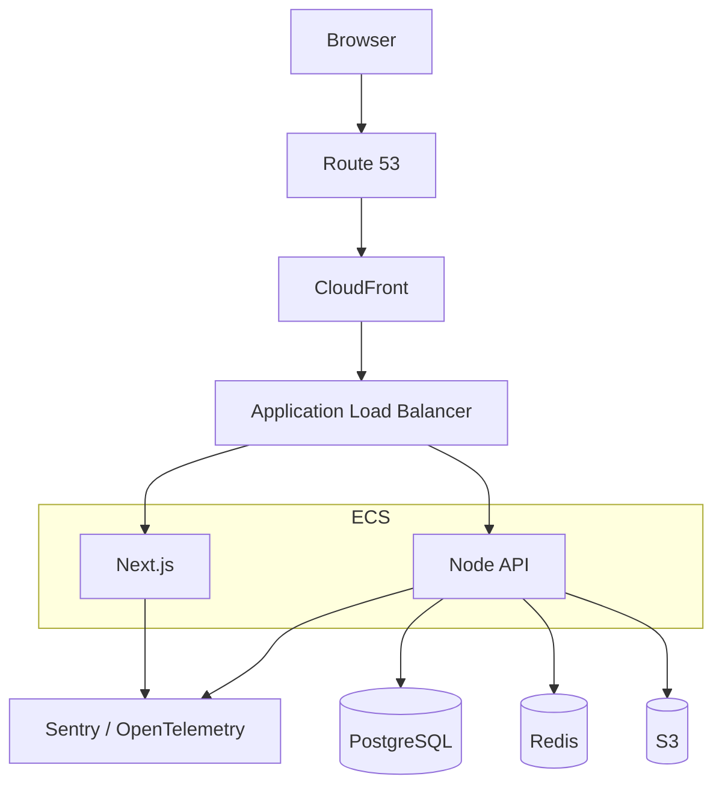
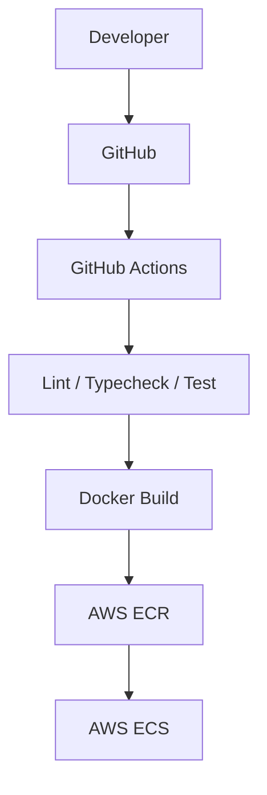
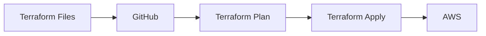

Do not learn this only from articles. Infrastructure knowledge that has never
survived contact with a broken deploy is not knowledge yet — it is vocabulary.

Build one small system. It does not need to be a good product idea; it needs a
frontend, an API, a database, and files to upload. A links app, a notes app or a
tiny store is plenty.

## The stack

```text
Next.js · Node.js · PostgreSQL · Redis
Docker · AWS · GitHub Actions · Terraform · Sentry
```

## Build it in stages

The value is in the order. Each stage should work before the next begins.

**Stage 1 — Local.** Frontend, API and Postgres, running with Docker Compose.
You will meet the
[localhost problem](/frontend-infrastructure/docker) and the difference between
[server-side and browser URLs](/frontend-infrastructure/docker-networking).

**Stage 2 — One server.** A VPS, Nginx in front, a real domain, HTTPS via Let's
Encrypt. This stage teaches [DNS](/frontend-infrastructure/dns),
[TLS](/frontend-infrastructure/https-and-tls) and
[proxy headers](/frontend-infrastructure/reverse-proxies) — and you will get the
redirect loop that teaches `X-Forwarded-Proto`.

**Stage 3 — Pipeline.** GitHub Actions builds the image, pushes it to a
registry, and deploys on merge to `main`. Add branch protection.
See [CI/CD](/frontend-infrastructure/ci-cd).

**Stage 4 — Cloud.** Move to managed services: ECS or Cloud Run for containers,
RDS for the database, S3 for uploads, CloudFront in front.

**Stage 5 — Observability.** Sentry with source maps, structured logs with
request IDs, and Web Vitals from real users.

**Stage 6 — Terraform.** Reproduce the whole thing as code, then destroy and
rebuild staging to prove it works.

## The target architecture



## The pipeline



## And the infrastructure itself



At which point you have built the full journey:

```text
Code
 ↓
Git
 ↓
CI/CD
 ↓
Docker
 ↓
Cloud
 ↓
Load Balancer
 ↓
Application
 ↓
Database
 ↓
Monitoring
```

## Exercises worth doing deliberately

The stages above teach you to build. These teach you to operate — and they are
where most of the learning actually is:

- **Break it on purpose.** Stop the database container. What does the user see?
  Is it in your logs? Did you get alerted?
- **Roll back.** Deploy a broken version, then get production healthy again.
  Time yourself.
- **Find a slow request** using only traces and logs, with no local reproduction.
- **Rotate a secret** with no downtime.
- **Destroy staging** with Terraform and rebuild it from scratch.
- **Check your bundle** for anything that should not be public.

<Callout>
Set a billing alarm before Stage 4, and tear down cloud resources when you are
not using them. An idle ALB and RDS instance cost real money whether or not
anyone visits your practice app.
</Callout>
